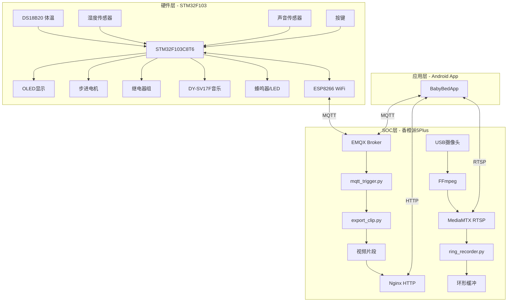

# 智能婴儿床远程监控系统 - 技术详解文档

## 📋 目录

1. [项目概述](#项目概述)
2. [系统架构](#系统架构)
3. [硬件层 - STM32下位机](#硬件层---stm32下位机)
4. [SOC层 - 香橙派服务](#soc层---香橙派服务)
5. [应用层 - Android App](#应用层---android-app)
6. [通信协议](#通信协议)
7. [关键代码详解](#关键代码详解)
8. [技术栈总结](#技术栈总结)

---

## 项目概述

### 项目背景
本系统是一套完整的**智能婴儿床远程监控解决方案**，实现了对婴儿状态的全方位实时监测、智能响应和远程控制。系统能够自动检测婴儿体温、尿湿状态、哭声，并在异常情况下自动触发安抚机制（摇篮、音乐）。同时支持通过手机App进行远程视频监控、事件回放和设备控制。

### 核心功能
| 功能模块 | 描述 |
|----------|------|
| **体温监测** | DS18B20传感器实时采集体温，异常报警 |
| **尿湿检测** | ADC采集湿度传感器数据，判断尿床状态 |
| **哭声识别** | 声音传感器检测哭声，触发安抚 |
| **自动摇篮** | 步进电机驱动，检测到哭声自动摇动 |
| **安抚音乐** | DY-SV17F语音模块，自动播放摇篮曲 |
| **实时视频** | USB摄像头 + RTSP推流，手机实时预览 |
| **事件录像** | 哭声触发自动录制30秒视频片段 |
| **远程控制** | App控制风扇、加热、摇篮等设备 |

---

## 系统架构

### 整体架构图



### 数据流向

1. **传感器 → STM32**: 采集体温、湿度、声音数据
2. **STM32 → ESP8266 → EMQX**: 通过MQTT上报设备状态
3. **EMQX → App**: App订阅状态主题，实时显示数据
4. **App → EMQX → STM32**: 用户发送控制命令
5. **声音触发 → SOC导出**: 哭声检测触发视频录制
6. **视频回放**: App通过HTTP获取事件列表和视频文件

---

## 硬件层 - STM32下位机

### 硬件配置

| 组件 | 型号 | 功能 | 接口 |
|------|------|------|------|
| 主控 | STM32F103C8T6 | 核心控制 | - |
| WiFi | ESP8266 | 网络通信 | UART2 |
| 显示 | 0.96寸OLED | 状态显示 | I2C |
| 温度 | DS18B20 | 体温采集 | 单总线 |
| 湿度 | 湿度传感器 | 尿湿检测 | ADC1 |
| 声音 | 声音传感器 | 哭声检测 | GPIO |
| 电机 | 28BYJ-48 | 摇篮驱动 | GPIO |
| 音乐 | DY-SV17F | 安抚音乐 | IO触发 |

### 核心代码结构

```
Project_C8/
├── Core/
│   └── Src/
│       └── main.c              # 主程序
├── HAL/
│   ├── AliESP8266/
│   │   ├── AliESP8266.c        # ESP8266 MQTT通信
│   │   └── AliESP8266.h
│   ├── OLED/
│   │   └── OLED_NEW.c          # OLED显示驱动
│   ├── ds18b20/
│   │   └── ds18b20.c           # 温度传感器驱动
│   └── key/
│       └── key.c               # 按键扫描
```

### 主循环逻辑 (main.c)

```c
while (1)
{
    Key_function();              // 按键扫描
    Monitor_function();          // 传感器监测 + 自动控制
    Display_function();          // OLED显示
    Ali_MQTT_Recevie();          // 接收MQTT命令
    Ali_MQTT_Trigger_CryEvent(); // 哭声触发SOC录像
}
```

### 传感器监测与自动控制 (Monitor_function)

```c
void Monitor_function(void)
{
    // 1. 体温采集 (每500ms)
    body_temp = Ds18b20_Read_Temp();
    
    // 2. 湿度采集 (ADC)
    HAL_ADC_Start(&hadc1);
    adc_value = HAL_ADC_GetValue(&hadc1);
    humi = (adc_value / 4095.00) * 100;
    
    // 3. 哭声检测 + 自动摇篮
    if(voice == 0) {  // 检测到哭声
        Motor_Status |= 0x81;  // 启动摇篮
    }
    
    // 4. 音乐控制 (自动模式)
    if(mode == 0) {  // 自动模式
        if(voice == 0) {
            lullabuy(0);  // 播放音乐
        } else {
            lullabuy(1);  // 停止音乐
        }
    }
    
    // 5. 温度自动调节
    if(mode == 0) {  // 自动模式
        if(body_temp < 35*10) {      // 体温低于35℃
            hot_flag = 1;             // 开启加热
            fan_flag = 0;
        } else if(body_temp > 37*10) {
            fan_flag = 1;             // 开启风扇
            hot_flag = 0;
        }
    }
    
    // 6. 定时上报MQTT状态
    if(flag_1 == 1) {
        Ali_MQTT_Publish_1();
    }
}
```

### MQTT通信实现 (AliESP8266.c)

#### 状态上报

```c
void Ali_MQTT_Publish_2(void)
{
    char payload[256];
    int offset = 0;
    
    // 构建JSON状态
    offset += snprintf(payload + offset, sizeof(payload) - offset,
        "{\"temp_x10\":%d,\"temp_alarm\":%d,\"wet\":%d,\"cry\":%d,"
        "\"mode\":%d,\"fan\":%d,\"hot\":%d,\"crib\":%d,\"music\":%d}",
        body_temp,
        beep_temp,
        beep_humi,
        (voice == 0) ? 1 : 0,
        mode,
        fan_flag,
        hot_flag,
        crib_flag,
        music_flag);
    
    // 发送AT命令
    sprintf(cmd, "AT+MQTTPUB=0,\"%s\",\"%s\",0,0\r\n", 
            TOPIC_STATUS, payload);
    HAL_UART_Transmit(&Huart_wifi, cmd, strlen(cmd), 1000);
}
```

#### 命令接收

```c
void Ali_MQTT_Recevie(void)
{
    if(strstr(ESP8266_buf, "+MQTTSUBRECV:")) {
        // 解析JSON命令
        if(strstr(ESP8266_buf, "\"fan\":1"))
            relay_fan(1);
        if(strstr(ESP8266_buf, "\"hot\":1"))
            relay_hot(1);
        if(strstr(ESP8266_buf, "\"music\":1")) {
            music_app_override = 1;  // App覆盖自动控制
            lullabuy(0);
        }
        // ... 更多命令解析
    }
}
```

#### 哭声触发SOC录像

```c
#define CRY_DEBOUNCE_COUNT 5        // 去抖次数
#define CRY_TRIGGER_INTERVAL_MS 60000  // 60秒节流

void Ali_MQTT_Trigger_CryEvent(void)
{
    static uint8_t cry_count = 0;
    static uint32_t last_trigger = 0;
    
    if(voice == 0) {  // 检测到哭声
        cry_count++;
        if(cry_count >= CRY_DEBOUNCE_COUNT) {
            uint32_t now = HAL_GetTick();
            if(now - last_trigger > CRY_TRIGGER_INTERVAL_MS) {
                // 发送触发消息到SOC
                sprintf(cmd, "AT+MQTTPUB=0,\"babycam/trigger\","
                        "\"{\\\"event\\\":\\\"cry\\\",\\\"seconds\\\":30}\",0,0\r\n");
                HAL_UART_Transmit(&Huart_wifi, cmd, strlen(cmd), 1000);
                last_trigger = now;
            }
            cry_count = 0;
        }
    } else {
        cry_count = 0;  // 重置计数
    }
}
```

---

## SOC层 - 香橙派服务

### 系统架构

香橙派5Plus运行多个服务，协同工作：

| 服务 | 功能 | 技术 |
|------|------|------|
| EMQX | MQTT消息代理 | Docker容器 |
| MediaMTX | RTSP服务器 | Docker容器 |
| babycam-push | 摄像头推流 | FFmpeg |
| babycam-ring | 环形录像 | FFmpeg |
| babycam-trigger | 事件触发录像 | Python |
| Nginx | HTTP静态文件 | 原生 |

### 服务配置文件路径

```
/etc/systemd/system/
├── babycam-push.service     # 摄像头推流
├── babycam-ring.service     # 环形录像
├── babycam-trigger.service  # 触发服务
└── babycam-clips-http.service  # HTTP服务

/var/log.hdd/babycam/
├── ring/                    # 环形录像缓冲
├── clips/                   # 导出的视频片段
├── events/
│   └── events.jsonl         # 事件日志
└── trigger/
    ├── mqtt_trigger.py      # 触发服务脚本
    └── export_clip.py       # 视频导出脚本
```

### 视频推流配置 (babycam-push.service)

```ini
[Service]
ExecStart=/usr/bin/ffmpeg \
  -f v4l2 \
  -input_format mjpeg \
  -framerate 15 \
  -video_size 640x480 \
  -i /dev/video0 \
  -c:v libx264 \
  -preset ultrafast \
  -tune zerolatency \
  -profile:v baseline \
  -g 15 \
  -b:v 800k \
  -f rtsp \
  -rtsp_transport tcp \
  rtsp://127.0.0.1:8554/babycam
```

**参数说明**：
- `-preset ultrafast -tune zerolatency`: 最低延迟编码
- `-g 15`: 每秒1个关键帧，减少花屏
- `-b:v 800k`: 适合远程传输的码率

### MQTT触发服务 (mqtt_trigger.py)

```python
class MQTTTriggerService:
    def __init__(self):
        self.client = mqtt.Client()
        self.client.username_pw_set("admin", "public")
        self.local_ip = "100.115.202.71"  # Tailscale IP
        
    def on_message(self, client, userdata, msg):
        payload = json.loads(msg.payload)
        if payload.get("event") == "cry":
            seconds = payload.get("seconds", 30)
            self.export_clip(seconds)
    
    def export_clip(self, seconds):
        # 调用export_clip.py导出视频
        timestamp = datetime.now().strftime("%Y%m%d_%H%M%S")
        filename = f"{timestamp}_{seconds}s.mp4"
        
        subprocess.run([
            "python3", "/var/log.hdd/babycam/trigger/export_clip.py",
            "--duration", str(seconds),
            "--output", f"/var/log.hdd/babycam/clips/{filename}"
        ])
        
        # 记录事件日志
        event = {
            "ts": int(time.time()),
            "type": "cry",
            "seconds": seconds,
            "file": filename,
            "url": f"http://{self.local_ip}:8099/clips/{filename}",
            "created_at": datetime.now().isoformat()
        }
        
        with open("/var/log.hdd/babycam/events/events.jsonl", "a") as f:
            f.write(json.dumps(event) + "\n")
        
        # 发送通知
        self.client.publish("babycam/notify", json.dumps({
            "type": "clip_ready",
            "url": event["url"]
        }))
```

### 视频导出脚本 (export_clip.py)

```python
def export_clip(duration, output_path):
    ring_dir = "/var/log.hdd/babycam/ring"
    
    # 获取最近的ts文件
    ts_files = sorted(glob.glob(f"{ring_dir}/*.ts"))
    
    # 计算需要的文件数量
    needed_files = ts_files[-(duration // 3 + 2):]
    
    # 创建文件列表
    with open("/tmp/concat.txt", "w") as f:
        for ts in needed_files:
            f.write(f"file '{ts}'\n")
    
    # 合并并转换为MP4
    subprocess.run([
        "ffmpeg", "-y",
        "-f", "concat", "-safe", "0",
        "-i", "/tmp/concat.txt",
        "-c:v", "copy",
        "-t", str(duration),
        output_path
    ])
```

### Nginx HTTP配置

```nginx
server {
    listen 8099;
    root /var/log.hdd/babycam;
    autoindex on;
    client_max_body_size 100M;
    
    location / {
        try_files $uri $uri/ =404;
        add_header Access-Control-Allow-Origin *;
        sendfile on;
        tcp_nopush on;
    }
}
```

---

## 应用层 - Android App

### 项目结构

```
BabyBedApp/app/src/main/
├── java/com/example/babybedapp/
│   ├── MainActivity.java       # 主界面
│   ├── LoginActivity.java      # 登录
│   ├── EventsActivity.java     # 事件时间轴
│   ├── VideoPlayerActivity.java # 视频播放
│   ├── LiveViewActivity.java   # 实时预览
│   ├── MqttManager.java        # MQTT管理
│   ├── SocConfig.java          # SOC配置
│   ├── BabyCamEvent.java       # 事件模型
│   └── EventAdapter.java       # 事件列表适配器
├── res/layout/
│   ├── activity_main.xml       # 主界面布局
│   ├── activity_events.xml     # 事件列表布局
│   ├── activity_live_view.xml  # 实时预览布局
│   └── item_event.xml          # 事件项布局
└── res/drawable/
    ├── bg_gradient_main.xml    # 渐变背景
    ├── bg_card_round.xml       # 圆角卡片
    └── bg_button_*.xml         # 按钮样式
```

### 核心依赖 (build.gradle)

```groovy
dependencies {
    // MQTT客户端
    implementation 'org.eclipse.paho:org.eclipse.paho.client.mqttv3:1.2.5'
    implementation 'org.eclipse.paho:org.eclipse.paho.android.service:1.1.1'
    
    // ExoPlayer视频播放
    implementation 'androidx.media3:media3-exoplayer:1.2.0'
    implementation 'androidx.media3:media3-ui:1.2.0'
    implementation 'androidx.media3:media3-exoplayer-rtsp:1.2.0'
    
    // UI组件
    implementation 'androidx.swiperefreshlayout:swiperefreshlayout:1.1.0'
    implementation 'androidx.cardview:cardview:1.0.0'
}
```

### MQTT管理器 (MqttManager.java)

```java
public class MqttManager {
    private static final String BROKER_URL = "tcp://100.115.202.71:1883";
    private static final String TOPIC_STATUS = "device/esp8266_01/status";
    private static final String TOPIC_CMD = "device/esp8266_01/cmd";
    
    private MqttAndroidClient client;
    private StatusCallback callback;
    
    public void connect() {
        client = new MqttAndroidClient(context, BROKER_URL, clientId);
        
        MqttConnectOptions options = new MqttConnectOptions();
        options.setUserName("admin");
        options.setPassword("public".toCharArray());
        options.setAutomaticReconnect(true);
        options.setCleanSession(false);
        
        client.connect(options, null, new IMqttActionListener() {
            @Override
            public void onSuccess(IMqttToken token) {
                subscribeToTopics();
            }
        });
    }
    
    public void sendCommand(String key, int value) {
        JSONObject cmd = new JSONObject();
        cmd.put("cmd_id", System.currentTimeMillis());
        cmd.put(key, value);
        
        client.publish(TOPIC_CMD, 
            cmd.toString().getBytes(), 1, false);
    }
    
    // 状态回调接口
    public interface StatusCallback {
        void onStatusUpdate(DeviceStatus status);
        void onConnectionChanged(boolean connected);
    }
}
```

### 事件时间轴 (EventsActivity.java)

```java
public class EventsActivity extends AppCompatActivity {
    private RecyclerView recyclerView;
    private EventAdapter adapter;
    private List<BabyCamEvent> events = new ArrayList<>();
    
    private void loadEvents() {
        String url = socConfig.getEventsUrl();
        
        new Thread(() -> {
            try {
                // 下载events.jsonl
                URL eventsUrl = new URL(url);
                BufferedReader reader = new BufferedReader(
                    new InputStreamReader(eventsUrl.openStream()));
                
                String line;
                events.clear();
                while ((line = reader.readLine()) != null) {
                    if (!line.trim().isEmpty()) {
                        BabyCamEvent event = BabyCamEvent.fromJson(line);
                        if (event != null) {
                            events.add(0, event);  // 最新的在前面
                        }
                    }
                }
                
                runOnUiThread(() -> adapter.notifyDataSetChanged());
            } catch (Exception e) {
                showError("加载失败");
            }
        }).start();
    }
    
    private void playVideo(BabyCamEvent event) {
        Intent intent = new Intent(this, VideoPlayerActivity.class);
        intent.putExtra("video_url", event.getUrl());
        startActivity(intent);
    }
}
```

### 实时预览 (LiveViewActivity.java)

```java
public class LiveViewActivity extends AppCompatActivity {
    private ExoPlayer player;
    
    private void initPlayer() {
        // 低延迟配置
        LoadControl loadControl = new DefaultLoadControl.Builder()
            .setBufferDurationsMs(500, 2000, 500, 500)
            .build();
        
        player = new ExoPlayer.Builder(this)
            .setLoadControl(loadControl)
            .build();
        
        // RTSP源
        String rtspUrl = "rtsp://" + socConfig.getSocIp() + ":8554/babycam";
        RtspMediaSource source = new RtspMediaSource.Factory()
            .setTimeoutMs(10000)
            .setForceUseRtpTcp(true)
            .createMediaSource(MediaItem.fromUri(rtspUrl));
        
        player.setMediaSource(source);
        player.prepare();
        player.play();
    }
}
```

### UI设计特点

采用现代化母婴风格设计：

1. **渐变背景**: 粉紫蓝柔和渐变
2. **大圆形温度显示**: 醒目的核心数据展示
3. **状态卡片**: 分区展示各项监测数据
4. **Emoji图标**: 增添亲和力
5. **玻璃态效果**: 卡片半透明阴影

---

## 通信协议

### MQTT主题定义

| 主题 | 方向 | 用途 |
|------|------|------|
| `device/esp8266_01/status` | 设备→App | 状态上报 |
| `device/esp8266_01/cmd` | App→设备 | 控制命令 |
| `device/esp8266_01/ack` | 设备→App | 命令确认 |
| `babycam/trigger` | 设备→SOC | 视频触发 |
| `babycam/notify` | SOC→App | 视频就绪通知 |

### 状态消息格式

```json
{
    "temp_x10": 368,      // 体温×10 (36.8℃)
    "temp_alarm": 0,      // 体温报警
    "wet": 0,             // 尿湿状态
    "cry": 0,             // 哭声状态
    "mode": 0,            // 0自动/1手动
    "fan": 0,             // 风扇状态
    "hot": 0,             // 加热状态
    "crib": 0,            // 摇篮状态
    "music": 0            // 音乐状态
}
```

### 控制命令格式

```json
{
    "cmd_id": 1703589600000,
    "fan": 1,
    "hot": 0,
    "music": 1
}
```

### 触发消息格式

```json
{
    "event": "cry",
    "seconds": 30,
    "ts": 1703589600
}
```

---

## 技术栈总结

### 硬件层
| 技术 | 用途 |
|------|------|
| STM32F103 HAL库 | 硬件抽象层 |
| FreeRTOS (可选) | 实时操作系统 |
| 单总线协议 | DS18B20通信 |
| UART AT指令 | ESP8266控制 |
| I2C | OLED显示 |
| PWM/GPIO | 电机/继电器控制 |

### SOC层
| 技术 | 用途 |
|------|------|
| Docker | 容器化部署 |
| EMQX | MQTT消息代理 |
| FFmpeg | 视频编解码 |
| MediaMTX | RTSP服务 |
| Python | 业务逻辑脚本 |
| Nginx | HTTP静态服务 |
| systemd | 服务管理 |
| Tailscale | 远程VPN访问 |

### 应用层
| 技术 | 用途 |
|------|------|
| Android Java | 原生开发 |
| Paho MQTT | MQTT客户端 |
| ExoPlayer | 视频播放 |
| RecyclerView | 列表展示 |
| CardView | UI卡片 |
| Material Design | 设计语言 |

### 通信协议
| 协议 | 用途 |
|------|------|
| MQTT | 设备状态/控制 |
| RTSP | 实时视频流 |
| HTTP | 文件下载 |
| JSON | 数据格式 |
| JSONL | 日志格式 |

---

## 项目亮点

1. **完整的端到端解决方案**: 从传感器采集到手机显示的全链路实现
2. **低延迟视频流**: RTSP + 优化编码参数实现秒级延迟
3. **事件驱动录像**: 按需录制节省存储空间
4. **自动安抚机制**: 智能响应婴儿状态
5. **远程访问能力**: Tailscale VPN支持随时随地查看
6. **现代化UI设计**: 母婴风格温馨界面

---

*文档生成时间: 2025-12-26*
