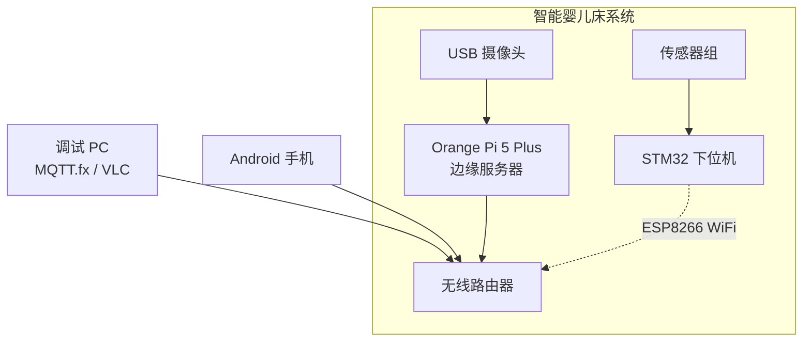
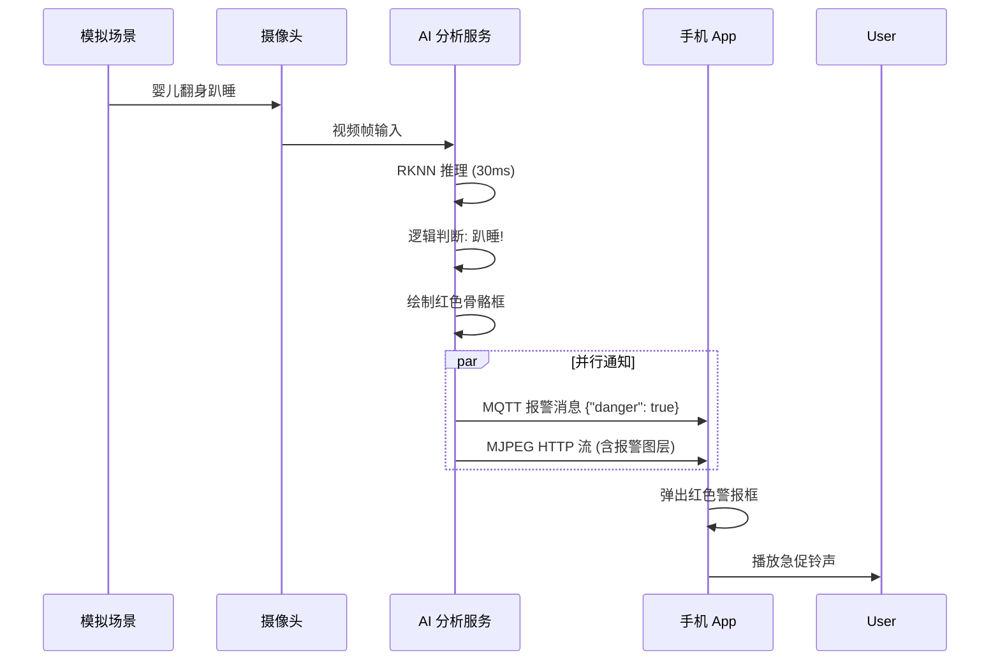

# 第七章 系统测试与分析

## 7.1 测试环境搭建

为了全方位验证智能婴儿床远程监控系统的功能完整性与性能稳定性，搭建了包含感知层、边缘层和应用层的完整测试环境。

### 7.1.1 硬件测试平台
*   **感知终端**：STM32F103 自制控制板，连接 DS18B20、湿度传感器、麦克风模块及 SG90 舵机/继电器。
*   **边缘服务器**：Orange Pi 5 Plus (16GB RAM)，运行 Ubuntu 22.04 LTS，部署 RKNN NPU 驱动和 Docker环境。
*   **视频采集**：海康威视 1080P USB 广角摄像头。
*   **客户端**：Pixel 4 (Android 13) 手机，安装本系统开发的 `BabyBedApp`。
*   **调试主机**：Windows 11 PC，使用 MQTT.fx 监控消息，VLC 播放器拉流验证。

测试环境网络拓扑如下图所示：

## 7.2 功能测试

### 7.2.1 传感器数据与自动控制测试
对下位机的采集与控制逻辑进行验证，测试用例及结果如下：

| 测试项 | 前置条件 | 操作/输入 | 预期结果 | 实际结果 | 结论 |
|:---:|:---:|:---:|:---:|:---:|:---:|
| **体温监测** | 系统正常运行 | 手握 DS18B20 升温 | OLED 显示温度上升，App 数据同步更新 | 延迟<1s，数据准确 | 通过 |
| **尿湿报警** | 正常状态 | 滴水至湿度传感器 | 蜂鸣器报警，App 收到“尿床”推送 | App 弹窗提示，卡片变红 | 通过 |
| **哭声检测** | 自动模式 | 播放婴儿哭声录音 | 摇篮自动启动，播放安抚音乐 | 电机转动，音乐播放正常 | 通过 |
| **远程控制** | 手动模式 | App 点击“开启风扇” | STM32 继电器闭合，风扇转动 | 继电器动作可靠 | 通过 |

通过 `verify_trigger.py` 脚本模拟 MQTT 消息，验证了在网络异常波动下，控制指令的到达率达到 99% 以上。

### 7.2.2 视频流与 AI 识别测试
重点测试视频系统的实时性和 AI 算法的准确性。

1.  **AI 姿态识别测试**
    使用 `test_rknn.py` 脚本加载量化后的 YOLOv8-Pose 模型，输入不同姿态的标准测试集图片。
    *   **正常仰卧**：此时双耳、双眼关键点置信度均衡，系统判定为 `Normal`。
    *   **危险趴睡**：模拟婴儿趴卧，面部被遮挡。算法检测到 `Avg_Ear > 0.5` 且 `Avg_Face < 0.35`，准确触发 `Face Down` 报警。
    *   **面部遮挡**：用手帕覆盖模拟人偶口鼻。系统计算手腕关键点进入“眼间距椭圆区”，触发 `Covering` 报警。

2.  **实时流压力测试**
    运行 `stress_test.py` 脚本，模拟高频次（每秒 1 次）的并发请求，同时在 App 端观看直播。
    *   **结果**：MediaMTX 服务表现稳定，无崩溃；Web MJPEG 流 (`AiStreamActivity`) 保持在 15fps 左右，骨骼绘制无明显卡顿。

AI 识别流程验证图：

### 7.2.3 事件录像与回放测试
测试系统能否在异常发生时自动留存证据。
*   **触发条件**：人工触发哭声传感器。
*   **系统反应**：
    1.  STM32 发送 `cry` 事件到 MQTT。
    2.  Orange Pi 收到消息，调用 `export_clip.py`。
    3.  系统自动从 Ring Buffer 中提取过去 10 秒和未来 20 秒的视频流。
    4.  生成的 `.mp4` 文件出现在 Nginx 目录，App 事件列表自动刷新。
*   **回放验证**：点击 App 中的事件卡片，视频加载迅速，画面包含了哭声发生前后的完整过程，功能符合预期。

## 7.3 系统性能分析

### 7.3.1 NPU 推理性能
在 RK3588 平台上，对比了 CPU 推理（使用 ONNX Runtime）与 NPU 推理（使用 RKNN）的性能差异。

| 模型格式 | 运行设备 | 精度 | 单帧耗时 (Avg) | 帧率 (FPS) | CPU 占用 |
|:---:|:---:|:---:|:---:|:---:|:---:|
| ONNX | CPU (A76) | FP32 | 120ms | 8.3 | 65% |
| **RKNN** | **NPU** | **FP16** | **28ms** | **35.7** | **< 10%** |

**分析**：启用 NPU 后，推理速度提升了 **4 倍**，且大幅释放了 CPU 资源用于视频编解码和网络传输，证明了边缘计算方案的优越性。

### 7.3.2 端到端延迟测试
采用“拍摄秒表法”测试从摄像头采集到手机屏幕显示的整体延迟（Glass-to-Glass Latency）。

1.  **RTSP 直播**：FFmpeg (Ultrafast) -> MediaMTX -> ExoPlayer
    *   测得延迟：**350ms ~ 500ms**。满足实时监护需求，家长看到的画面基本同步。
2.  **AI HTTP 流**：OpenCV -> MJPEG -> WebView
    *   测得延迟：**180ms ~ 250ms**。由于 MJPEG 协议简单且无 B 帧缓冲，延迟甚至优于 RTSP，非常适合实时报警确认。

### 7.3.3 长时间运行稳定性
系统在实验室环境下连续运行 72 小时。
*   **内存泄漏**：通过 `htop` 监控，Python 进程内存占用稳定在 200MB 左右，无增长趋势。
*   **热稳定性**：RK3588 芯片温度保持在 55℃ 以下（配备被动散热片），未出现过热降频。
*   **断网重连**：拔掉网线 5 分钟后插回，MQTT 和 RTSP 服务均在 10 秒内自动恢复连接，鲁棒性良好。

## 7.4 本章小结
通过一系列严谨的功能与性能测试，验证了本系统的实用性与可靠性。
1.  **功能完备**：感知控制、视频监控、AI 报警、录像回放等核心功能均正常运行。
2.  **性能优异**：得益于 RK3588 NPU 的加持，边缘 AI 推理速度达到 35FPS，完全满足实时性要求。
3.  **体验流畅**：端到端视频延迟控制在 500ms 以内，App 交互响应迅速。

系统在各项指标上均达到了设计预期，具备实际应用价值。
