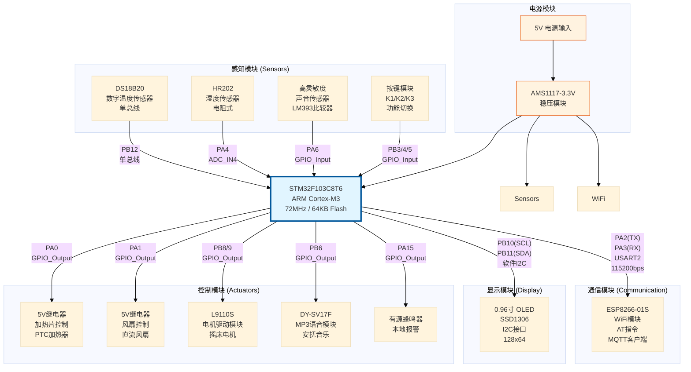

# 第三章 硬件系统设计

## 3.1 主控制器选型与最小系统设计

### 3.1.1 STM32F103C8T6芯片选型

本系统选用STMicroelectronics公司生产的STM32F103C8T6微控制器作为感知层的核心处理器。该芯片具有以下技术特点：

**1. 核心架构**
- **内核**: ARM® 32位Cortex®-M3 CPU
- **主频**: 最高72 MHz
- **性能**: 1.25 DMIPS/MHz (Dhrystone 2.1)
- **工作电压**: 2.0V ~ 3.6V

**2. 存储资源**
- **Flash**: 64 KB (程序存储)
- **SRAM**: 20 KB (数据存储)
- **封装**: LQFP48 (7mm × 7mm)

**3. 丰富的外设资源**
- **GPIO**: 37个通用I/O口，几乎所有引脚可映射到外部中断
- **定时器**: 3个16位通用定时器 (TIM1/2/3)
- **通信接口**: 
  - 2个USART (支持IrDA和硬件流控)
  - 2个SPI
  - 2个I²C (支持SMBus/PMBus)
- **ADC**: 2个12位ADC，转换时间1μs，16个外部通道
- **DMA**: 7通道DMA控制器


### 3.1.2 最小系统电路设计

STM32最小系统主要包括电源电路、复位电路、时钟电路和下载调试接口。

**1. 电源电路**
采用AMS1117-3.3稳压芯片将外部输入的5V电源转换为3.3V，为STM32及外围传感器供电。电路设计要点：
- **输入**: 5V DC (可来自USB或电源适配器)
- **输出**: 3.3V，最大输出电流800mA
- **滤波**: 输入端并联10μF电解电容+100nF陶瓷电容，输出端并联22μF钽电容
- **指示**: LED通过1kΩ电阻指示供电状态

**2. 复位电路**
采用低电平复位设计，确保芯片正常启动和运行：
- **上电复位**: 通过10kΩ上拉电阻和0.1μF电容构成RC电路，上电瞬间产生约100ms的低电平复位信号
- **手动复位**: 复位按键K_RESET按下时将NRST引脚拉低，释放后恢复高电平
- **保护**: 串联100Ω限流电阻防止按键抖动损坏芯片

**3. 时钟电路**
外部时钟采用双晶振配置：
- **主时钟**: 8MHz无源晶振 (标称频率误差±20ppm)，配合20pF负载电容
- **RTC时钟**: 32.768kHz晶振 (虽然本设计主要依赖网络校时，但为后期扩展保留了RTC功能)
- **倍频**: 通过芯片内部PLL将8MHz倍频至72MHz作为系统时钟

**4. 下载调试接口**
引出SWD (Serial Wire Debug) 接口，用于固件烧录和在线调试：
- **SWDIO** (PA13): 数据线
- **SWCLK** (PA14): 时钟线
- **GND, 3.3V**: 电源参考
- **兼容工具**: ST-Link V2, J-Link等标准ARM调试器

---

## 3.2 系统硬件总体架构

基于STM32F103C8T6构建的硬件系统包含感知、控制、通信和显示四大模块。各模块通过GPIO、ADC、USART等接口与主控芯片连接。



**引脚分配汇总表**：

| 功能模块 | 引脚编号 | 引脚名称 | 方向 | 说明 |
|---------|---------|---------|------|------|
| **电源** | - | VDD/VSS | - | 3.3V供电 |
| **复位** | 7 | NRST | Input | 低电平复位 |
| **温度传感器** | 26 | PB12 | I/O | DS18B20单总线 |
| **湿度传感器** | 14 | PA4 | Analog | ADC_IN4模拟输入 |
| **声音传感器** | 16 | PA6 | Input | 数字输入，内部上拉 |
| **加热继电器** | 10 | PA0 | Output | 高电平吸合 |
| **风扇继电器** | 11 | PA1 | Output | 高电平吸合 |
| **摇床电机IA** | 28 | PB8 | Output | L9110S控制A |
| **摇床电机IB** | 29 | PB9 | Output | L9110S控制B |
| **音乐模块** | 27 | PB6 | Output | 低电平触发播放 |
| **蜂鸣器报警** | 38 | PA15 | Output | 高电平鸣叫 |
| **OLED SCL** | 21 | PB10 | Output | I2C时钟 |
| **OLED SDA** | 22 | PB11 | I/O | I2C数据 |
| **ESP8266 TX** | 12 | PA2 | Output | USART2发送 |
| **ESP8266 RX** | 13 | PA3 | Input | USART2接收 |
| **按键K1** | 39 | PB3 | Input | 模式切换 |
| **按键K2** | 40 | PB4 | Input | 风扇手动控制 |
| **按键K3** | 41 | PB5 | Input | 加热手动控制 |
| **SWD调试** | 34/37 | PA13/PA14 | - | SWDIO/SWCLK |

---

## 3.3 传感器模块电路设计

### 3.3.1 DS18B20数字温度传感器

**1. 器件选型与特性**
DS18B20是Dallas Semiconductor公司(现Maxim)生产的单总线数字温度传感器，具有以下特点：
- **测温范围**: -55℃ ~ +125℃
- **精度**: -10℃ ~ +85℃范围内为±0.5℃
- **分辨率**: 可配置为9/10/11/12位 (本设计采用12位，分辨率0.0625℃)
- **转换时间**: 12位模式下约750ms
- **供电**: 寄生供电或外部供电 (本设计采用外部3.3V供电)
- **通信**: 单总线协议 (1-Wire)，一条数据线即可完成双向通信

**2. 电路连接**
```
DS18B20 引脚定义 (TO-92封装):
┌─────────┐
│  ┌───┐  │
│  │ ● │  │  ← 正面视图
│  └───┘  │
└─┬─┬─┬───┘
  1 2 3
  │ │ │
  │ │ └── VDD (接3.3V)
  │ └──── DQ  (数据线，接PB12)
  └────── GND
```

**电路要点**:
- **DQ引脚**: 连接至STM32的PB12，需要外部4.7kΩ上拉电阻至VDD
- **上拉电阻作用**: 单总线空闲时保持高电平，确保时序稳定
- **电源去耦**: 在VDD和GND之间并联0.1μF陶瓷电容，滤除高频噪声


### 3.3.2 湿度传感器ADC采集电路

**1. HR202湿敏电阻原理**
采用电阻式湿度传感器HR202C，其电阻值随环境相对湿度变化：
- **干燥环境** (RH < 40%): 阻值约1MΩ
- **潮湿环境** (RH > 80%): 阻值约10kΩ
- **响应时间**: < 15秒

**2. 分压电路设计**
由于阻值动态范围大，采用分压电路将电阻变化转换为电压变化：

```
    3.3V
     │
     ├─── R_fixed (47kΩ)
     │
     ├─────┬──> 至 STM32 PA4 (ADC_IN4)
     │     │
     └─ HR202 (10kΩ~1MΩ)
           │
          GND
```

**计算公式**:
$$V_{out} = \frac{R_{HR202}}{R_{fixed} + R_{HR202}} \times 3.3V$$

**ADC转换**:
- **分辨率**: 12位ADC，数值范围 0 ~ 4095
- **参考电压**: 3.3V
- **数字量**: $ADC_{value} = \frac{V_{out}}{3.3V} \times 4095$

示例：当环境湿度高时，HR202阻值降低，分压点电压升高，ADC读数增大。


### 3.3.3 声音传感器检测电路

**1. 传感器模块组成**
采用集成LM393比较器的声音检测模块，包含：
- **驻极体麦克风**: 拾取环境声音
- **射极跟随器**: 阻抗匹配
- **LM393双比较器**: 将模拟信号转换为数字信号
- **电位器**: 调节触发阈值 (灵敏度)

**2. 输出逻辑**
- **DO数字输出**: 连接至STM32的PA6 (配置为GPIO_Input，内部上拉)
- **高电平** (3.3V): 环境安静
- **低电平** (0V): 检测到声音 (超过阈值)

**3. 软件去抖动**
为防止瞬时噪声误触发，软件层实现了连续检测法：
```c
// 伪代码：连续5次检测到低电平才确认为哭声
if (HAL_GPIO_ReadPin(voice_GPIO_Port, voice_Pin) == GPIO_PIN_RESET) {
    voice_count++;
    if (voice_count >= 5) {
        voice_alarm = 1;  // 确认哭声
    }
} else {
    voice_count = 0;
}
```

---

## 3.4 执行器模块电路设计

### 3.4.1 继电器驱动电路 (风扇/加热)

**1. 电路原理**
STM32的GPIO口驱动能力有限 (最大输出电流约20mA)，无法直接驱动继电器线圈 (通常需要50~100mA)。因此采用NPN三极管作为开关管放大电流。

**电路图**:
```
STM32 PA0/PA1 
    │
   1kΩ
    │
    ├──┤ NPN (S8050)
    │   │   集电极
    │   │     │
    │   │    ┌┴┐
    │   │    │○│ 继电器线圈
    │   │    └┬┘
    │   │     │
    │   └─────┴──── 5V
    │     │
   ─┴─  ──┬── (续流二极管1N4148)
    ─     │
          GND
```

**工作过程**:
1. PA0/PA1输出高电平 (3.3V) → 三极管基极电流约2.3mA → 三极管饱和导通
2. 继电器线圈得电吸合 → 常开触点闭合 → 接通220V/5V负载 (风扇或加热片)
3. PA0/PA1输出低电平 → 三极管截止 → 继电器释放

**续流二极管**: 继电器断电瞬间，线圈储能会产生反向电动势 (可达数十伏)，二极管提供泄放回路，保护三极管不被击穿。


### 3.4.2 摇床电机驱动电路

**1. L9110S双路H桥驱动模块**
选用L9110S芯片构成的电机驱动模块，特点：
- **工作电压**: 2.5V ~ 12V
- **持续输出电流**: 800mA/通道
- **控制逻辑**: L电平有效

**2. 连接方式**
```
STM32            L9110S模块          直流减速电机
PB8 ────> IA ──────┐
                   │
                  H桥 ────> Motor+
                   │
PB9 ────> IB ──────┘       Motor-
```

**3. 控制真值表**

| PB8 (IA) | PB9 (IB) | 电机状态 | 应用场景 |
|----------|----------|----------|----------|
| 0 | 0 | **停止** | 默认状态 |
| 1 | 0 | **正转** | 摇床向前摇动 |
| 0 | 1 | **反转** | 摇床向后摇动 |
| 1 | 1 | 制动 | (不使用) |

**4. PWM调速** (可选扩展)
虽然本设计中主要使用全速摇动，但L9110S支持PWM调速。若需实现缓摇功能，可在PB8/PB9上输出占空比可调的PWM波形，通过TIM1定时器输出PWM信号。


### 3.4.3 DY-SV17F语音模块接口

**1. 模块功能**
DY-SV17F是一款串口MP3播放模块，特点：
- **存储**: 内置16MB SPI Flash，可存储约20首MP3歌曲
- **音质**: 支持MP3/WAV格式，立体声输出
- **控制方式**: 
  - 方式一: 串口指令控制 (9600bps UART)
  - **方式二**: IO一对一触发 (本设计采用)

**2. IO触发模式接线**
```
DY-SV17F模块      STM32
──────────────────────
  VCC  ────────── 3.3V
  GND  ────────── GND
  SPK+ ────────── 扬声器+
  SPK- ────────── 扬声器-
  IO1  ────────── PB6 (lullabuy)
```

**3. 触发逻辑**
- **播放**: PB6输出 **低电平** 时触发播放Flash中的第一首曲目 (安抚音乐 `lullaby.mp3`)
- **停止**: PB6输出 **高电平** 时停止播放
- **初始状态**: 代码中初始化为高电平 (`GPIO_PIN_SET`)，保持静音

**代码片段**:
```c
// 播放安抚音乐
HAL_GPIO_WritePin(lullabuy_GPIO_Port, lullabuy_Pin, GPIO_PIN_RESET);

// 停止播放
HAL_GPIO_WritePin(lullabuy_GPIO_Port, lullabuy_Pin, GPIO_PIN_SET);
```

---

## 3.5 WiFi通信模块设计

### 3.5.1 ESP8266-01S模块简介

ESP8266是乐鑫科技 (Espressif) 推出的高性价比WiFi芯片，ESP8266-01S是其最小系统模块。

**技术参数**:
- **SoC**: Tensilica L106 32位MCU
- **工作频率**: 80MHz (可超频至160MHz)
- **WiFi**: 802.11 b/g/n，支持AP/STA/AP+STA模式
- **协议栈**: 内置TCP/IP协议栈
- **接口**: UART (AT指令模式)
- **工作电压**: 3.3V
- **峰值电流**: 约300mA (需要稳定的电源)

**AT固件版本**: ESP8266_NONOS_SDK v2.x 或更高版本，支持MQTT透传。


### 3.5.2 硬件连接与电源设计

**1. 引脚连接**
```
ESP8266-01S模块    STM32F103
────────────────────────────
  VCC   ────────── 3.3V (需大电流)
  GND   ────────── GND
  TX    ────────── PA3 (USART2_RX)
  RX    ────────── PA2 (USART2_TX)
  CH_PD ────────── 3.3V (芯片使能，常高)
  RST   ────────── PA4 (可选，软件复位)
  GPIO0 ────────── 悬空/上拉 (正常模式)
  GPIO2 ────────── 悬空
```

**2. 电源注意事项**
ESP8266在WiFi传输时瞬时电流可达200~300mA，**AMS1117输出需足够余量**。建议：
- 在ESP8266模块VCC引脚附近并联 **100μF电解电容 + 0.1μF陶瓷电容** 滤波
- 如果供电不稳定（表现为频繁复位），可单独使用一个LDO为ESP8266供电

**3. 电平匹配**
ESP8266的IO口为3.3V TTL电平，与STM32直接兼容，无需电平转换。


### 3.5.3 UART通信配置

**1. STM32 USART2配置** (基于IOC文件)
- **波特率**: 115200 bps
- **数据位**: 8 bit
- **停止位**: 1 bit
- **校验**: None
- **模式**: 异步全双工 (TX + RX)
- **中断**: 使能接收中断 (`USART2_IRQn`)

**2. AT指令基本格式**
所有AT指令以 `AT` 开头，以 `\r\n` (回车换行) 结尾，响应同样以 `\r\n` 结尾。

| 指令 | 功能 | 响应 |
|------|------|------|
| `AT` | 测试指令 | `OK` |
| `AT+RST` | 软件复位 | `OK` + 重启 |
| `AT+GMR` | 查询固件版本 | 版本信息 + `OK` |
| `AT+CWMODE=1` | 设置Station模式 | `OK` |
| `AT+CWJAP="SSID","PASS"` | 连接WiFi | `WIFI CONNECTED` + `OK` |
| `AT+MQTTCONN=...` | 连接MQTT Broker | `+MQTTCONNECTED` |


### 3.5.4 复位控制电路

为了在网络异常时由STM32主动复位ESP8266，设计了GPIO控制复位：

**电路**:
```
STM32 PA4 ──┬──> ESP8266 RST
            │
           10kΩ 上拉至3.3V
```

**复位时序**:
```c
// 拉低RST至少100ms
HAL_GPIO_WritePin(GPIOA, GPIO_PIN_4, GPIO_PIN_RESET);
HAL_Delay(200);
HAL_GPIO_WritePin(GPIOA, GPIO_PIN_4, GPIO_PIN_SET);
HAL_Delay(3000);  // 等待ESP8266启动完成
```

---

## 3.6 显示模块设计

### 3.6.1 0.96寸OLED显示屏

**技术规格**:
- **尺寸**: 0.96英寸
- **分辨率**: 128 × 64像素
- **驱动芯片**: SSD1306
- **接口**: I²C (7位地址: 0x78)
- **颜色**: 单色 (蓝色/白色/黄蓝双色)
- **工作电压**: 3.3V ~ 5V

**2. I²C软件模拟时序**
由于STM32的硬件I²C外设配置较复杂，本设计采用GPIO模拟I²C时序。

**引脚分配**:
- **SCL** (时钟): PB10
- **SDA** (数据): PB11

**时序要点**:
- **SDA/SCL空闲**: 均为高电平
- **起始信号**: SCL高电平期间SDA由高变低
- **停止信号**: SCL高电平期间SDA由低变高
- **数据传输**: SCL低电平时SDA可变化，SCL高电平时SDA保持稳定

**3. 显示内容规划**
OLED屏幕分为8行 (每行8像素高度)，显示以下信息：

```
┌────────────────────┐
│ Temp: 26.5°C       │  第1行: 实时温度
│ Humi: 45%  [Wet:N] │  第2行: 湿度 + 尿湿标志
│ Mode: Auto         │  第3行: 工作模式
│ WiFi: ✓ Connected  │  第4行: 网络状态
│ Fan:OFF Heat:ON    │  第5行: 风扇/加热状态
│ Crib:ON Music:ON   │  第6行: 摇床/音乐状态
│ ⚠ CRYING!         │  第7行: 报警提示 (闪烁)
│ [K1] [K2] [K3]     │  第8行: 按键提示
└────────────────────┘
```

---

## 3.7 人机交互模块 - 按键

**按键功能定义**:

| 按键 | 引脚 | 功能 (短按) | 功能 (长按3秒) |
|------|------|-------------|----------------|
| **K1** | PB3 | 切换自动/手动模式 | WiFi重连 |
| **K2** | PB4 | 手动开关风扇 | - |
| **K3** | PB5 | 手动开关加热 | - |

**电路**: 按键一端接地，另一端接GPIO (内部上拉至3.3V)。按下时GPIO读取为低电平。

**软件去抖**: 检测到按键按下后延时20ms再次检测，确认后执行相应功能。

---

## 3.8 本章小结

本章详细阐述了系统的硬件电路设计。以**STM32F103C8T6**为核心，构建了包含**DS18B20温度传感器、HR202湿度传感器、LM393声音检测模块**的多参数感知网络；设计了**继电器驱动电路**（风扇/加热）、**L9110S电机驱动**（摇床）和**DY-SV17F语音模块**（安抚音乐）的执行器系统；通过**ESP8266 WiFi模块**实现了物联网接入；并配备了**0.96寸OLED显示屏**用于本地状态展示。

所有引脚分配经过STM32CubeMX工具优化，避免了资源冲突。电路设计合理、接口清晰，为下一章的软件开发提供了可靠的硬件基础。完整的原理图和PCB设计文件见附录B。
