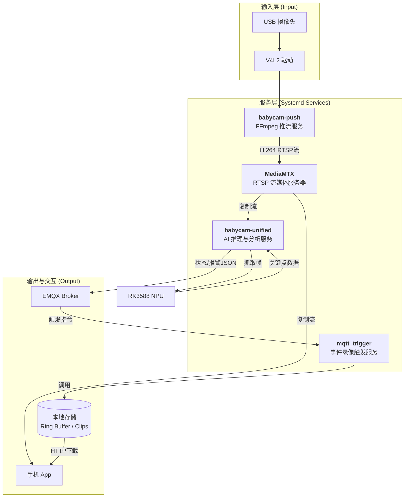
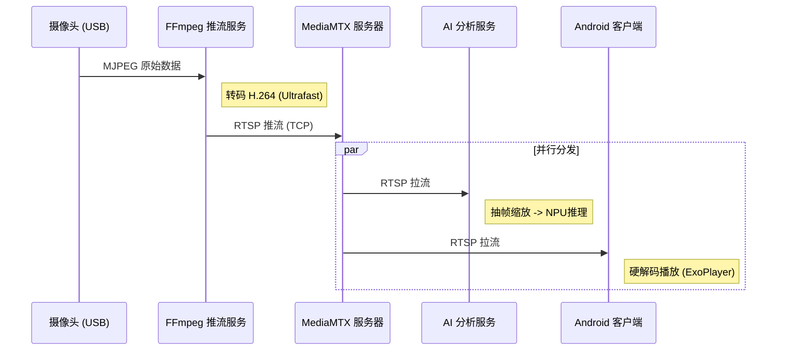

# 第五章 边缘AI系统设计与部署

## 5.1 边缘计算平台选型与架构

### 5.1.1 硬件平台：Orange Pi 5 Plus
本系统作为家庭场景下的实时监护设备，对算力、编解码能力和功耗有着严苛要求。经过对比，最终选用 **Orange Pi 5 Plus** 作为边缘计算核心主板。该平台基于瑞芯微（Rockchip）新一代旗舰芯片 **RK3588**，其核心优势如下：

1.  **多核异构架构**：采用 8nm 工艺，集成了四核 Cortex-A76 (2.4GHz) 和四核 Cortex-A55 (1.8GHz) CPU，在保证高性能计算的同时有效控制了待机功耗。
2.  **高算力 NPU**：内置三核独立 NPU，综合算力可达 **6 TOPS**。支持 INT4/INT8/INT16/FP16 混合运算，能够高效运行 YOLO 系列深度学习模型，是本系统实现“本地AI分析”的硬件基础。
3.  **强大的多媒体引擎**：支持 8K@60fps 的 H.265/H.264 视频硬件解码和 8K@30fps 编码。本系统利用其强大的编解码能力，轻松应对多路视频流的转码与分发任务。
4.  **丰富的外设接口**：板载双 2.5G 以太网口和 PCIe 3.0 M.2 接口，为高速网络传输和 NVMe SSD 快速存储提供了物理保障。

### 5.1.2 边缘侧软件系统架构
为了保障系统的稳定性与可维护性，边缘侧软件采用了微服务化的设计思想。各个功能模块（推流、流媒体转发、AI 推理、录像存储）被拆分为独立的系统服务，由 Linux 的 `systemd` 守护进程统一管理。

系统整体架构如下图所示：



## 5.2 视频采集与低延迟流媒体系统

### 5.2.1 视频采集与编码优化
视频源采用 USB 接口的高清摄像头，通过 Video4Linux2 (V4L2) 接口进行采集。为了满足“实时监护”对低延迟的极致追求，FFmpeg 推流服务（`babycam-push-optimized.service`）进行了深度优化配置：

*   **编码器选择**：采用 `libx264` 编码器，配置 `-preset ultrafast` 预设，以牺牲微小的压缩率为代价换取最快的编码速度。
*   **零延迟调优**：使用 `-tune zerolatency` 选项，禁用 B 帧（因 B 帧需要双向参考，会引入缓冲延迟），强行设置为 I 帧和 P 帧序列。
*   **GOP 结构**：设置 `-g 10 -keyint_min 10`，即将关键帧间隔设为 10 帧（约 1 秒），确保客户端在连接时能迅速获取 I 帧并渲染画面，减少首屏加载时间。
*   **码率控制**：采用 CBR（固定码率）模式，`-b:v 500k -maxrate 600k -bufsize 300k`，防止画面剧烈变化时码率突增导致的次级网络拥塞。

### 5.2.2 流媒体分发链路
流媒体服务器采用 **MediaMTX**（原 rtsp-simple-server）。它作为一个高性能的 RTSP 代理，负责将 FFmpeg 推送的单一视频流（Publisher）分发给多个消费者（Subscribers）：
1.  **AI 分析进程**：从 `localhost` 拉流进行每秒 10-15 帧的抽样分析。
2.  **移动端 App**：供家长实时查看画面。
3.  **录像进程**：将视频流切片保存为 `.ts` 文件用于回放。

完整视频数据链路如下：



## 5.3 边缘AI算法设计与实现

### 5.3.1 模型选型与RKNN部署
系统采用 **YOLOv8-Pose** 模型。相较于传统的目标检测（仅输出矩形框），Pose 模型能输出人体 **17 个关键点（Keypoints）** 的坐标与置信度，为姿态分析提供了精细的几何特征。

为了在 RK3588 上高效运行，模型经历了以下转换流程：
1.  **模型导出**：将 PyTorch `.pt` 权重导出为 `.onnx` 格式，输入尺寸固定为 320x320。
2.  **量化转换**：使用 `rknn-toolkit2` 工具，将模型转换为 RKNN 格式。配置 `target_platform='rk3588'`，并启用 **optimization_level=3** 和 **FP16**（半精度浮点）量化。
3.  **输入归一化**：在转换配置中设定 `mean=[0,0,0], std=[255,255,255]`，利用 NPU 硬件自动完成 0-255 到 0-1 的归一化操作，减轻 CPU 预处理负担。

### 5.3.2 姿态及危险行为与检测算法
基于 Pose 模型输出的骨骼数据，本研究设计了一套基于 **启发式规则（Heuristic Rules）** 的行为分析算法，能有效识别婴儿的危险状态。

核心判断逻辑流程图如下：

```mermaid
flowchart TD
    Start[获取17个关键点] --> CheckPerson{检测到人体?}
    CheckPerson -->|否| NoPerson[状态: 无人/离床]
    CheckPerson -->|是| CalcConf[计算面部/耳部<br>平均置信度]
    
    CalcConf --> CheckProne{耳部清晰 &<br>面部模糊?}
    CheckProne -->|是| Prone[<b>危险: 趴睡</b><br>(Face Down)]
    Prone --> AlgoEnd
    
    CheckProne -->|否| CheckSide{左右耳<br>置信度差大?}
    CheckSide -->|是| Side[状态: 侧卧]
    CheckSide -->|否| Back[状态: 仰卧]
    
    Side --> CheckCover{手腕位于<br>口鼻椭圆区?}
    Back --> CheckCover
    
    CheckCover -->|是| Cover[<b>危险: 口鼻遮挡</b><br>(Covering)]
    CheckCover -->|否| CheckMotion{长期静止?}
    
    CheckMotion -->|是| Static[<b>警报: 异常静止</b>]
    CheckMotion -->|否| Normal[状态正常]
    
    AlgoEnd((结束))
    Cover --> AlgoEnd
    Static --> AlgoEnd
    Normal --> AlgoEnd
    NoPerson --> AlgoEnd
```

**关键算法细节**：
1.  **趴睡检测 (Prone Detection)**：
    利用“俯视视角”的特性。当婴儿趴睡时，摄像头能清晰拍摄到头部两侧的耳朵（Lear, Rear 置信度高），但无法拍摄到鼻子和眼睛（Nose, Eye 置信度低）。
    *   判据： `(Avg_Ear_Conf > 0.5) AND (Avg_Face_Conf < 0.35)`

2.  **遮挡检测 (Covering Detection)**：
    构建以鼻子为中心，以“双眼间距”为基准单位的动态椭圆区域。
    *   $Radius_X = 5.0 \times EyeDistance$
    *   $Radius_Y = 3.2 \times EyeDistance$
    *   判据：若左/右手腕关键点（Wrist）落入该椭圆内，且持续一定帧数，判定为手部遮挡口鼻风险。

3.  **防抖动机制 (Debounce)**：
    引入迟滞比较器，只有连续 `DANGER_TRIGGER_FRAMES` (2帧) 检测到危险才触发报警；反之，需连续 `DANGER_RELEASE_FRAMES` (30帧) 正常才解除报警。这有效消除了因模型单帧跳变导致的误报。

### 5.3.3  多线程异步推理架构
为了最大化利用 RK3588 性能，`babycam_unified.py` 采用了多线程架构：
*   **Capture Thread**：利用 `deque(maxlen=1)` 维护一个最新的视频帧缓冲池，确保 NPU 永远处理最新的画面，避免处理滞后的积压帧。
*   **Main Thread**：负责从缓冲池取帧、调用 RKNN 推理、执行逻辑判断、并通过 MQTT 发布消息。
*   **Web Thread**：基于 Flask 框架，提供一个 MJPEG 流媒体接口 (`:8088/stream`)，将绘制了骨骼和报警信息的处理后图像实时传输给前端，实现 AI 可视化。

## 5.4 智能联动与存储服务

### 5.4.1 MQTT 消息联动
AI 服务通过 MQTT 协议与下位机和手机 App 实时联动。
*   **状态上报**：每秒发布 `babycam/ai/status` Topic，包含 JSON 格式的 posture（姿态）、danger（是否危险）、fps 等信息。
*   **严重警报**：当危险状态持续超过 15 秒（模拟人工确认时间）时，向 `babycam/ai/notify` 发布高优先级报警，触发手机端强制弹窗和铃声。

### 5.4.2 环形录像与事件导出
系统实现了基于文件系统的 **环形缓冲区 (Ring Buffer)** 录像机制：
1.  **切片存储**：FFmpeg 后台进程将视频流按每 10 秒切分为一个 `.ts` 文件，保存在 RAMDisk 或高速 SSD 目录中。
2.  **自动清理**：`babycam_cleanup.sh` 脚本每分钟运行，自动删除超过 24 小时的切片文件，确保存储空间不溢出。
3.  **事件回溯**：当检测到哭声（由 STM32 触发）或 AI 危险报警时，`mqtt_trigger.py` 调用导出脚本 `export_clip.py`。该脚本根据当前时间戳，快速索引前后的 `.ts` 切片文件，利用 FFmpeg 的 `concat` 协议瞬间合成一段 30 秒的 `.mp4` 视频，并建立 HTTP 下载索引，实现“事前+事后”的完整证据留存。

## 5.5 本章小结
本章详细阐述了边缘 AI 系统的软硬件实现。通过构建“Orange Pi + NPU + Systemd + MQTT”的技术栈，成功将复杂的深度学习推理任务部署在本地。创新的启发式姿态分析算法解决了单一模型难以识别特定危险行为的问题，而优化的 FFmpeg 推流和环形录像机制则保障了监控的实时性与可追溯性。整个边缘侧系统做到了低延迟、低带宽占用和高隐私保护，为上层应用提供了坚实的数据支撑。
