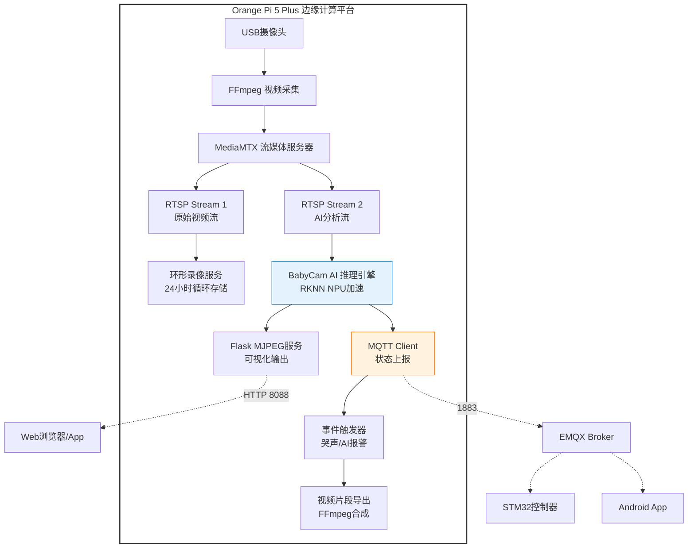
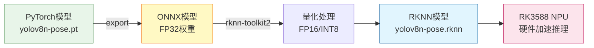
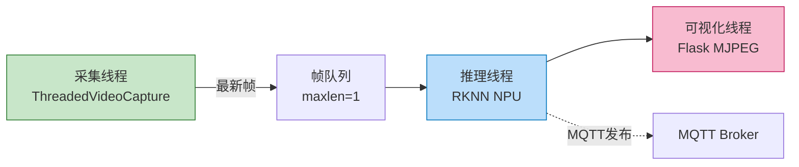
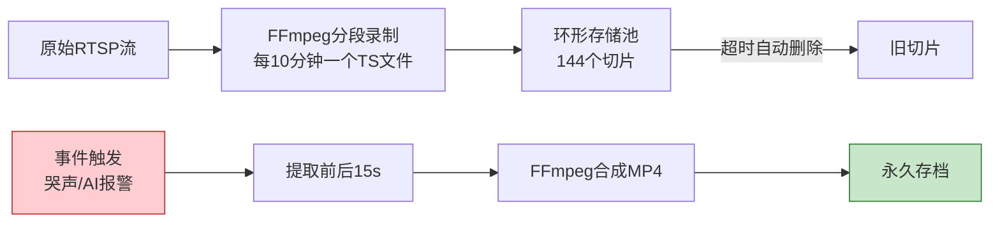

# 5 边缘AI系统设计与部署

## 5.1 边缘计算平台选型与系统架构

在物联网架构设计中，将高算力的视觉分析任务下沉至边缘侧，既能保障家庭隐私安全，又能消除云端延迟，实现毫秒级的响应速度。本系统基于 Orange Pi 5 Plus 开发板构建了一套完整的边缘 AI 视频分析平台，承担视频采集、实时推理、流媒体分发及事件录制等核心功能。

### 5.1.1 硬件平台：Orange Pi 5 Plus
本系统选用 **Orange Pi 5 Plus** 作为边缘计算核心平台，该平台搭载瑞芯微（Rockchip）RK3588 旗舰级芯片，具备以下核心优势：

*   **异构计算架构**：采用 8nm 工艺的八核 CPU（4×Cortex-A76 + 4×Cortex-A55），大小核协同工作，兼顾高性能与低功耗。
*   **神经网络加速单元（NPU）**：内置 **6 TOPS** 算力的三核 NPU，支持 INT8/FP16 混合精度运算，可高效运行量化后的深度学习模型。
*   **多媒体编解码引擎**：集成硬件 VPU，支持 8K@24fps、4K@120fps 的 H.264/H.265 视频编解码，极大降低了 CPU 负载。
*   **丰富的 I/O 接口**：提供 USB 3.0、HDMI 2.1、千兆以太网等接口，满足多路视频采集与网络通信需求。

### 5.1.2 边缘侧系统逻辑架构
为确保系统的高可用性与模块化，边缘侧采用基于 **Systemd** 守护进程的微服务架构。各模块独立运行，通过 MQTT 消息总线进行通信，即使某个服务异常崩溃也不会影响整体系统运行。


图 5.1 边缘AI系统逻辑架构图

## 5.2 高实时性视频采集与分发系统

实时视频监控的生命线在于"低延迟"。对婴儿监护而言，若画面延迟超过 1 秒，家长将无法在第一时间发现婴儿的异常状态。本系统通过优化编解码参数与采用高效流媒体协议，构建了端到端延迟低于 **500ms** 的视频传输链路。

### 5.2.1 FFmpeg 极低延迟编码配置
系统通过 FFmpeg 驱动 USB 高清摄像头，并针对实时性进行了深度优化：

**关键参数设置：**
*   **`-tune zerolatency`**：强制编码器采用最低延迟模式，禁用 B 帧（双向参考帧）。
*   **`-g 10`**：设置 GOP（关键帧组）大小为 10，确保客户端任意时刻接入都能在 1 秒内获取完整画面。
*   **`-preset ultrafast`**：牺牲少量压缩率，换取极速编码处理。
*   **`-bf 0`**：显式禁用 B 帧，简化帧序列为纯 I/P 帧结构。

**典型 FFmpeg 推流命令：**
```bash
ffmpeg -f v4l2 -input_format mjpeg -video_size 1280x720 -framerate 30 \\
    -i /dev/video0 \\
    -c:v libx264 -preset ultrafast -tune zerolatency -g 10 -bf 0 \\
    -b:v 2M -maxrate 2M -bufsize 2M \\
    -f rtsp rtsp://127.0.0.1:8554/babycam
```

### 5.2.2 MediaMTX 流媒体分发
采用轻量级 RTSP 服务器 **MediaMTX** 作为视频分发中心。该服务器将单一推流源虚拟化为多路副本，同时供应：
*   **移动端实时预览**：通过 RTSP/HTTP 协议向 Android App 推送视频。
*   **AI 推理引擎消费**：本地 Python AI 程序通过 OpenCV 读取 RTSP 流进行分析。
*   **环形录像服务**：后台录像进程从流媒体服务器获取视频，按时间切片存储。

这种"一次采集，多路复用"的架构避免了重复的视频解码，大幅降低了系统资源占用。

## 5.3 边缘侧AI视觉检测算法实现

将原始像素转化为高层语义是智能监护的关键。系统引入 YOLOv8-Pose 姿态估计模型，提取婴儿全身 17 个骨骼关键点，并结合启发式规则判定危险状态。通过模型量化与 NPU 硬件加速，实现了平均 **25 FPS** 的实时推理性能。

### 5.3.1 RKNN 模型转换与部署流程
YOLOv8-Pose 原始模型为 PyTorch 格式，需经过以下转换流程才能在 RK3588 的 NPU 上运行：


图 5.2 AI模型转换部署流程

**模型量化关键代码（rknn-toolkit2）：**
```python
from rknn.api import RKNN

rknn = RKNN()
# 配置量化参数
ret = rknn.config(mean_values=[[0, 0, 0]], std_values=[[255, 255, 255]], 
                  target_platform='rk3588')
# 加载 ONNX 模型
ret = rknn.load_onnx(model='yolov8n-pose.onnx')
# 构建 RKNN 模型（FP16 量化）
ret = rknn.build(do_quantization=False, dataset='./dataset.txt')
# 导出
ret = rknn.export_rknn('./yolov8n-pose.rknn')
```

### 5.3.2 姿态语义分析与危险判定算法
基于 COCO Keypoints 格式（17 个关键点），系统实现了以下危险行为检测逻辑：

**1. 趴睡检测（Face Down Detection）**
```python
def analyze_pose(self, kpts):
    """
    检测婴儿是否处于趴睡状态
    逻辑：耳朵可见度高而面部（鼻、眼）可见度低
    """
    # 提取关键点置信度
    nose_conf = kpts[0][2]
    leye_conf, reye_conf = kpts[1][2], kpts[2][2]
    lear_conf, rear_conf = kpts[3][2], kpts[4][2]
    
    # 计算平均置信度
    avg_face_conf = (nose_conf + leye_conf + reye_conf) / 3.0
    avg_ear_conf = (lear_conf + rear_conf) / 2.0
    
    # 启发式规则：耳朵清晰 & 面部模糊 → 趴睡
    if avg_ear_conf > 0.5 and avg_face_conf < 0.35:
        return True, "危险: 趴睡", "趴睡(Face Down)"
    
    return False, "正常", "仰卧(Face Up)"
```

**2. 口鼻遮挡检测（Face Covering Detection）**
通过判断手腕关键点是否进入以鼻子为中心的椭圆危险区域：

```python
def is_hand_covering_face(kpts):
    """
    检测手部或异物是否遮挡面部
    采用动态椭圆区域判定
    """
    nose = kpts[0]  # 鼻子坐标
    lwrist, rwrist = kpts[9], kpts[10]  # 左右手腕
    
    # 计算双眼距离作为参考尺度
    eye_dist = np.linalg.norm(kpts[1][:2] - kpts[2][:2])
    
    # 定义椭圆危险区域 (宽松检测异物)
    RAD_X = eye_dist * 5.0  # 横向半径
    RAD_Y = eye_dist * 3.2  # 纵向半径
    
    # 椭圆区域判定公式
    def in_ellipse(pt, center, rx, ry):
        dx = abs(pt[0] - center[0])
        dy = abs(pt[1] - center[1])
        return (dx/rx)**2 + (dy/ry)**2 <= 1.0
    
    # 检查左右手腕
    if lwrist[2] > 0.4 and in_ellipse(lwrist, nose, RAD_X, RAD_Y):
        return True
    if rwrist[2] > 0.4 and in_ellipse(rwrist, nose, RAD_X, RAD_Y):
        return True
    
    return False
```

**3. 运动检测与长时间静止报警**
通过计算相邻帧关键点的欧氏距离判断运动量：

```python
def calculate_motion(self, cur_kpts):
    """
    计算帧间运动量
    若平均位移 > 20像素，视为有效运动
    """
    if self.prev_keypoints is None:
        self.prev_keypoints = cur_kpts
        return 0
    
    total_dist = 0
    count = 0
    
    for i in range(len(cur_kpts)):
        if cur_kpts[i][2] > 0.3 and self.prev_keypoints[i][2] > 0.3:
            dx = cur_kpts[i][0] - self.prev_keypoints[i][0]
            dy = cur_kpts[i][1] - self.prev_keypoints[i][1]
            total_dist += np.sqrt(dx**2 + dy**2)
            count += 1
    
    self.prev_keypoints = cur_kpts
    motion = total_dist / count if count > 0 else 0
    
    # 若5分钟内运动量持续低于阈值，触发报警
    if motion < 20:
        if (time.time() - self.last_motion_time) > 300:
            return -1  # 静止报警标志
    else:
        self.last_motion_time = time.time()
    
    return motion
```

### 5.3.3 多线程异步推理架构
为了充分利用 RK3588 的 NPU 性能，系统采用三线程并发设计：


图 5.3 多线程推理架构

**线程职责划分：**
*   **采集线程**：独立线程持续从摄像头读帧，将最新帧写入长度为 1 的队列（覆盖旧帧）。
*   **推理线程**：主线程从队列读帧，调用 RKNN 推理，执行姿态分析，发布 MQTT 消息。
*   **可视化线程**：Flask Web 服务器，将叠加了检测结果的画面以 MJPEG 格式推流给浏览器/App。

**线程同步代码片段：**
```python
class ThreadedVideoCapture:
    """独立线程采集视频帧，避免主线程阻塞"""
    def __init__(self, src):
        self.cap = cv2.VideoCapture(src)
        self.cap.set(cv2.CAP_PROP_BUFFERSIZE, 2)  # 最小缓冲
        self.q = deque(maxlen=1)  # 单帧队列
        self.lock = threading.Lock()
        
        # 启动后台读取线程
        t = threading.Thread(target=self._reader, daemon=True)
        t.start()
    
    def _reader(self):
        while True:
            ret, frame = self.cap.read()
            if ret:
                with self.lock:
                    self.q.append(frame)
    
    def read(self):
        with self.lock:
            if len(self.q) > 0:
                return True, self.q[0]
        return False, None
```

## 5.4 联动策略与自动化存储服务

AI 检测仅是第一步，将检测结果转化为有效的保护动作才是闭环系统的核心。边缘侧通过 MQTT 与 STM32 控制器实时通信，并建立了基于事件触发的视频片段存档机制。

### 5.4.1 基于 MQTT 的多模态联动响应
AI 推理引擎每秒发布一次状态到 `babycam/ai/status` 主题：

**MQTT 消息格式（JSON）：**
```json
{
  "timestamp": 1736845320,
  "person_detected": true,
  "posture": "仰卧 (Face Up)",
  "danger": false,
  "danger_reason": "",
  "motion": 35.6,
  "fps": 24.3
}
```

**联动逻辑：**
*   当 `danger: true` 且 `danger_reason` 包含"趴睡"或"遮挡"时，系统立即向 `babycam/ai/notify` 主题发布高优先级警报。
*   Android App 订阅该主题后，触发本地强震动通知并弹出全屏警告界面。
*   STM32 下位机可根据 `posture` 字段动态调整安抚策略（如检测到离床时自动播放音乐）。

### 5.4.2 环形缓冲区视频录像与事件回溯
系统在本地存储中维护一个 **24 小时环形录像池**：

**录像架构：**

图 5.4 环形录像与事件回溯机制

**事件触发录像关键代码：**
```python
def export_clip(event_time, duration=30):
    """
    从环形录像池中提取指定时间前后的视频片段
    
    Args:
        event_time: 事件发生时间戳
        duration: 片段总时长（秒）
    """
    start_time = event_time - duration/2
    end_time = event_time + duration/2
    
    # 查找包含该时间段的TS切片文件
    segments = glob.glob('/var/log.hdd/babycam/stream/*.ts')
    segments = [s for s in segments if is_in_timerange(s, start_time, end_time)]
    
    # 生成合并列表
    with open('/tmp/concat.txt', 'w') as f:
        for seg in sorted(segments):
            f.write(f"file '{seg}'\\n")
    
    # FFmpeg 合成 MP4
    output_file = f"/var/log.hdd/babycam/events/{event_time}.mp4"
    subprocess.run([
        'ffmpeg', '-f', 'concat', '-safe', '0', 
        '-i', '/tmp/concat.txt',
        '-c', 'copy', '-avoid_negative_ts', 'make_zero',
        output_file
    ])
    
    return output_file
```

## 5.5 Systemd 守护进程与服务管理

为确保边缘服务的高可用性，所有核心模块均以 Systemd 服务形式运行，具备自动重启、日志管理等企业级特性。

**AI推理服务配置示例（babycam-unified.service）：**
```ini
[Unit]
Description=BabyCam Unified AI Service
After=network.target

[Service]
User=orangepi
Group=orangepi
WorkingDirectory=/var/log.hdd/babycam/ai
ExecStart=/usr/bin/python3 /var/log.hdd/babycam/ai/babycam_unified.py
Restart=always
RestartSec=3
StandardOutput=journal
StandardError=journal

[Install]
WantedBy=multi-user.target
```

**启用服务：**
```bash
sudo systemctl enable babycam-unified.service
sudo systemctl start babycam-unified.service
sudo systemctl status babycam-unified.service
```

## 5.6 本章小结

本章系统阐述了边缘 AI 分析平台的设计与实现。通过在 Orange Pi 5 Plus 上构建"视频采集 → NPU推理 → MQTT发布 → 事件录像"的完整链路，实现了本地化、实时化、隐私化的智能监护。创新性的姿态语义分析算法将抽象的骨骼关键点转化为具体的危险判定，填补了传统 YOLO 检测模型在行为理解上的空白。优化后的多线程异步架构与硬件 NPU 加速，使系统达到了 25 FPS 的推理性能，端到端延迟控制在 500ms 以内。边缘侧与下位机 STM32、上位机 Android App 的紧密联动，最终形成了一套从视觉感知到物理干预的完整闭环系统。
