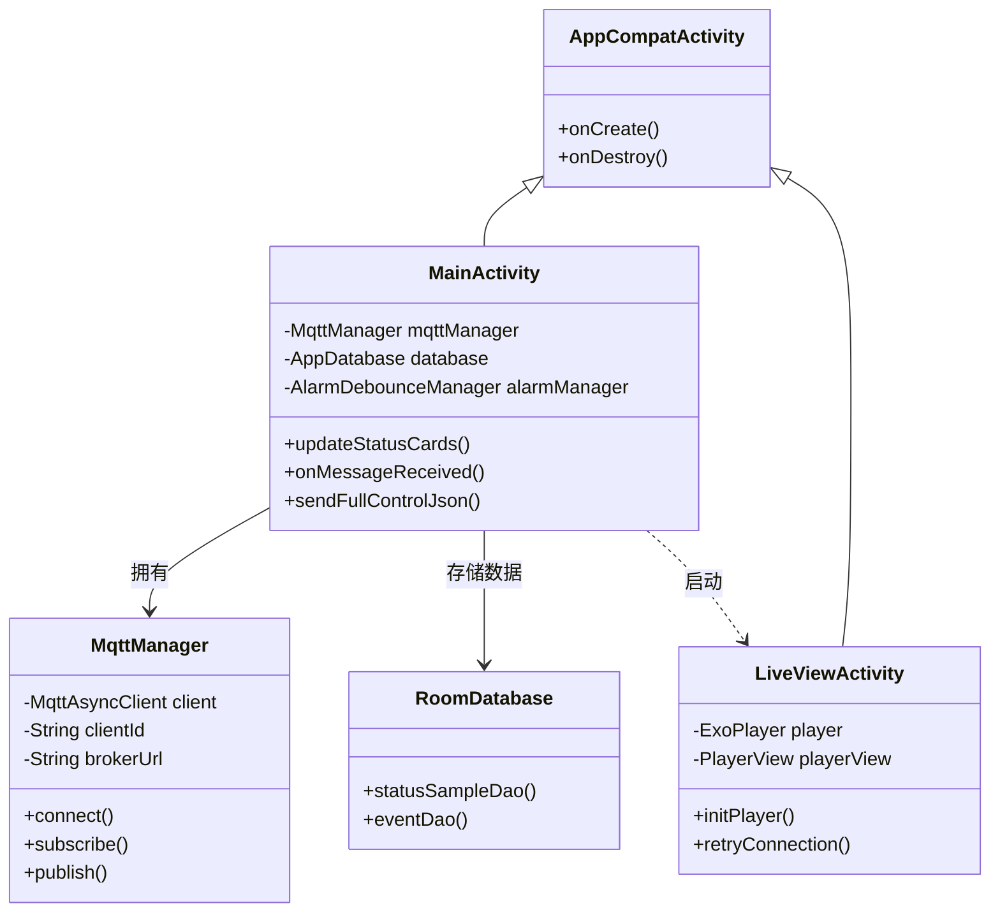
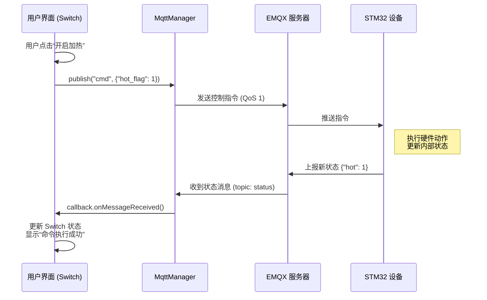

# 第六章 Android应用设计与实现

## 6.1 开发环境与技术栈选型

本系统的移动客户端基于 Android 平台开发，旨在为用户提供一个直观、实时且稳定的远程监护交互界面。

### 6.1.1 开发环境
*   **操作系统**: Windows 11
*   **IDE**: Android Studio Hedgehog 2023.1.1
*   **构建工具**: Gradle 8.0
*   **目标版本**: Android 13 (API Level 33)
*   **最低版本**: Android 8.0 (API Level 26)

### 6.1.2 核心技术栈
为了满足物联网应用对实时性、稳定性和数据持久化的要求，项目采用了以下关键技术库：
*   **通信层**: `org.eclipse.paho.client.mqttv3` —— 实现稳定的长连接通信，支持断线重连。
*   **视频播放**: `androidx.media3:media3-exoplayer` —— Google 官方推荐的媒体播放器，支持 RTSP 低延迟流媒体播放。
*   **数据存储**: `androidx.room` —— 官方 ORM 框架，提供类型安全和响应式的 SQLite 数据库访问。
*   **网络请求**: `Retrofit2` —— 用于 RESTful API 交互（与后端 AI 分析接口通信）。
*   **UI 组件**: `Material Components` & `CardView` —— 构建现代化的卡片式 UI 布局。

## 6.2 应用架构设计

系统并没有严格拘泥于 MVVM 模式，而是采用了一种 **事件驱动 (Event-Driven)** 的架构模式。`MainActivity` 作为核心控制器，通过 `MqttManager` 监听底层数据变化，并实时驱动 UI 更新和后台服务。

系统核心类结构关系如下图所示：

**核心模块职责**：
*   **MainActivity**: 负责主界面渲染、控制指令下发、通知管理和数据分发。它是整个 App 的“大脑”。
*   **MqttManager**: 封装了 Paho MQTT Client，负责建立 TCP 连接、订阅 Topic 和消息的回调分发，屏蔽了底层网络细节。
*   **LiveViewActivity**: 专注于 RTSP 视频流的硬解码播放，管理 ExoPlayer 的生命周期。
*   **AiStreamActivity**: 通过 WebView 加载边缘端 MJPEG 视频流，展示 AI 骨骼与报警图层。

## 6.3 MQTT 通信模块详细设计

通信模块是连接手机与嵌入式设备的桥梁。`MqttManager` 类实现了基于 `MqttAsyncClient` 的异步通信机制。

### 6.3.1 控制指令交互流程
为了确保控制指令（如开启加热）的可靠执行，系统设计了基于状态确认的闭环控制流程。不同于传统的 Request-Response 模型，本系统采用 **State Synchronization（状态同步）** 模式。

在 `MainActivity` 中，还设计了 **命令验证与去抖** 机制 (`CommandDebouncer`)。当用户连续快速点击开关时，系统会合并短时间内的操作，仅发送最后一次指令，避免网络拥塞和设备振荡。同时，发出指令后 UI 会进入“等待响应”状态（黄色提示），直到收到设备回传的新状态与预期一致时，才转为“成功”状态（绿色提示）。

## 6.4 数据持久化与事件记录

为了支持历史数据查询，系统集成了 Room 数据库。

### 6.4.1 数据库表结构
主要包含以下实体表：
1.  **StatusSample**：存储设备周期性上报的原始数据（每秒或由变化触发）。
    *   字段：`timestamp`, `temp`, `humidity`, `cry_status`, `mode`
2.  **Event**：存储报警事件，用于生成时间轴。
    *   字段：`id`, `type` (1001:体温, 1003:哭声), `value`, `time`, `is_read`
3.  **HourlyStat**：每小时聚合统计数据，用于长周期图表分析。
    *   字段：`hour_start`, `avg_temp`, `max_temp`, `cry_count`

### 6.4.2 报警防抖与记录策略
在 `AlarmDebounceManager` 中实现了智能报警逻辑。为了避免传感器数据在阈值附近波动导致手机疯狂震动，系统设置了冷却时间（Cool-down Period）。
*   **逻辑**：当收到 `status.tempAlarm == 1` 时，首先检查 `last_alarm_time`。只有当距离上次报警超过 60 秒（可配置），才会触发 `NotificationManager` 发送系统通知和弹窗，并写入一条新的 `Event` 记录。

## 6.5 视频监控模块实现

视频模块分为“实时直播”和“AI分析流”两个部分，分别针对不同的使用场景。

### 6.5.1 ExoPlayer RTSP 直播 (`LiveViewActivity`)
用于查看高清、流畅的实时画面。
*   **技术点**：强制使用 TCP 传输 (`setForceUseRtpTcp(true)`)。虽然 UDP 理论上延迟更低，但在复杂的家庭 WiFi 环境下，UDP 极易丢包导致花屏。TCP 保证了画面的完整性。
*   **低延迟配置**：自定义 `LoadControl`，将缓冲区大小限制在 500ms - 2000ms 之间，尽可能减少直播延迟。

### 6.5.2 AI 可视化流 (`AiStreamActivity`)
用于查看带有骨骼关键点和报警文字的 AI 分析结果。
*   **实现方式**：由于边缘端输出的是 MJPEG HTTP 流（一张张 JPEG 图片的连续传输），使用 Android 原生 `WebView` 进行加载是最兼容且高效的方案。
*   **适配与缩放**：通过注入 HTML/CSS 代码 (``)，确保视频画面在不同尺寸的手机屏幕上都能保持正确的比例并居中显示，背景填充黑色。

## 6.6 UI 交互与用户体验设计

### 6.6.1 主界面布局
主界面 (`activity_main.xml`) 采用垂直滚动布局，分为三个功能区：
1.  **状态概览区**：使用三个大号 `CardView` 分别展示体温、尿湿和哭声状态。这也是用户最关心的信息。卡片背景色会随状态变化（绿色正常，红色报警），并带有呼吸灯动画效果 (`ValueAnimator`) 增强视觉警示。
2.  **快捷控制区**：提供风扇、加热、摇床的开关控制。这些控件会根据当前的 `mode`（自动/手动）自动禁用或启用，防止用户误操作干扰自动控制逻辑。
3.  **数据统计区**：展示过去一小时内的平均温度和异常次数，让家长对近期情况心中有数。

### 6.6.2 通知与反馈
系统注册了名为 `baby_bed_alarms` 的通知渠道，并设置重要性为 `IMPORTANCE_HIGH`。
*   **前台反馈**：应用在前台运行时，会弹出 `AlertDialog` 对话框，强制提醒用户注意。
*   **后台反馈**：应用在后台时，发送带有震动和铃声的系统通知，点击通知可直接跳转到 App 查看详情。

## 6.7 本章小结
本章详细介绍了 Android 客户端的设计与实现。通过 MqttManager 实现了与底层设备的可靠通信，利用 Google ExoPlayer 解决了 RTSP 流媒体播放难题，并结合 Room 数据库完成了数据的本地化存储。UI 设计上注重状态反馈的即时性和直观性，配合智能报警防抖机制，极大提升了用户的使用体验。
