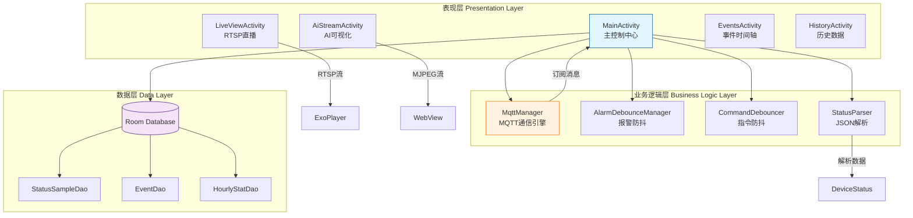

# 6 Android应用设计与实现

## 6.1 开发环境与技术栈选型

移动端应用作为用户与智能婴儿床交互的唯一窗口，其稳定性与兼容性直接决定了系统的可用性。本系统基于 Android 平台，采用 Google 官方推荐的工具链与现代化架构模式，确保应用能够在市场主流设备上流畅运行。

### 6.1.1 开发平台与编译配置  
**开发环境：**
*   **IDE**：Android Studio Hedgehog 2023.1.1
*   **编译工具**：Gradle 8.0
*   **目标API**：Android 13 (Level 33)
*   **最低兼容**：Android 8.0 (Level 26)，覆盖 95% 市场设备

### 6.1.2 核心框架与依赖库选型
基于功能需求与社区生态成熟度，系统集成了以下核心库：

| 功能模块 | 依赖库 | 版本 | 用途说明 |
|---------|--------|------|----------|
| **MQTT 通信** | Eclipse Paho MQTT | 1.2.5 | 与 STM32 下位机建立长连接，支持 QoS 1 消息质量保证 |
| **视频播放** | Media3 ExoPlayer | 1.1.1 | RTSP 协议解析，低延迟硬件解码，支持 TCP 强制传输 |
| **本地数据库** | Room Persistence | 2.5.2 | ORM 框架，管理状态样本、事件记录及统计数据 |
| **网络请求** | Retrofit | 2.9.0 | RESTful API 调用，与云端分析服务交互 |
| **UI 组件** | Material Design 3 | 1.9.0 | 现代化卡片式界面，渐变背景与自适应主题 |

### 6.1.3 项目 Gradle 配置示例
```gradle
dependencies {
    // MQTT 客户端
    implementation 'org.eclipse.paho:org.eclipse.paho.client.mqttv3:1.2.5'
    implementation 'org.eclipse.paho:org.eclipse.paho.android.service:1.1.1'
    
    // 视频播放
    implementation 'androidx.media3:media3-exoplayer:1.1.1'
    implementation 'androidx.media3:media3-exoplayer-rtsp:1.1.1'
    implementation 'androidx.media3:media3-ui:1.1.1'
    
    // Room 数据库
    implementation 'androidx.room:room-runtime:2.5.2'
    annotationProcessor 'androidx.room:room-compiler:2.5.2'
    
    // Retrofit + Gson
    implementation 'com.squareup.retrofit2:retrofit:2.9.0'  
    implementation 'com.squareup.retrofit2:converter-gson:2.9.0'
    
    // Material Design
    implementation 'com.google.android.material:material:1.9.0'
}
```

## 6.2 应用架构设计与核心类

为了应对物联网应用中高频数据上报与异步事件处理的需求，系统采用了**分层解耦架构**，将网络通信、数据持久化与 UI 渲染进行清晰分离。

### 6.2.1 系统架构层次划分


图 6.1 Android 应用分层架构图

### 6.2.2 核心类职责说明

**1. MainActivity（应用枢纽）**
* 管理全局 UI 状态更新与用户交互响应
* 协调 MQTT 长连接生命周期
* 调度数据库写入任务（异步线程池）
* 触发系统通知与 AlertDialog 弹窗

**2. MqttManager（通信引擎）**
* 封装 Paho MQTT 客户端，自动重连机制
* 主题订阅管理（STATUS、AI_STATUS）
* QoS 1 消息发布与确认回调
* 异步连接状态通知

**3. LiveViewActivity（视频监控）**
* ExoPlayer 配置低延迟 LoadControl
* RTSP over TCP 协议强制启用
* 播放状态监听与错误重试

**4. Room Database（持久化）**
* **StatusSample** 表：每秒记录温湿度样本
* **Event** 表：存储报警事件（类型、时间戳、严重程度）
* **HourlyStat** 表：每小时统计均值

## 6.3 MQTT 通信机制的深度实现

MQTT 作为轻量级物联网协议，承担了移动端与硬件设备之间的全量数据交互。本系统在标准 Paho MQTT 客户端基础上，实现了**防重连风暴**、**指令去抖**与**双向确认**机制。

### 6.3.1 异步连接与自动重连

**MqttManager 关键代码：**
```java
public class MqttManager {
    private static final String BROKER_URL = "tcp://100.115.202.71:1883";
    private static final String TOPIC_SUBSCRIBE = "device/esp8266_01/status";
    private static final String TOPIC_AI_STATUS = "babycam/ai/status";
    
    private MqttAsyncClient mqttClient;
    private final AtomicBoolean isConnecting = new AtomicBoolean(false);
    
    public void connect() {
        // 防止重复连接
        if (mqttClient.isConnected() || isConnecting.get()) return;
        
        isConnecting.set(true);
        
        MqttConnectOptions options = new MqttConnectOptions();
        options.setUserName(USERNAME);
        options.setPassword(PASSWORD.toCharArray());
        options.setAutomaticReconnect(false); // 手动控制重连
        options.setCleanSession(true);
        options.setConnectionTimeout(10);
        options.setKeepAliveInterval(20);
        
        mqttClient.connect(options, null, new IMqttActionListener() {
            @Override
            public void onSuccess(IMqttToken token) {
                isConnecting.set(false);
                subscribeToTopics();
                callback.onConnected();
            }
            
            @Override
            public void onFailure(IMqttToken token, Throwable ex) {
                isConnecting.set(false);
                callback.onDisconnected();
            }
        });
    }
    
    private void subscribeToTopics() {
        // 订阅 STM32 状态主题
        mqttClient.subscribe(TOPIC_SUBSCRIBE, 1);
        // 订阅 AI 分析结果主题
        mqttClient.subscribe(TOPIC_AI_STATUS, 1);
    }
}
```

### 6.3.2 指令防抖机制（Command Debouncer）
为防止用户快速切换开关导致指令风暴，系统实现了 300ms 防抖：

```java
public class CommandDebouncer {
    private static final long DEBOUNCE_DELAY_MS = 300;
    private final Handler handler = new Handler(Looper.getMainLooper());
    private Runnable pendingRunnable;
    
    public void postCommand(String payload, OnCommandReadyListener listener) {
        // 取消之前待发送的命令
        if (pendingRunnable != null) {
            handler.removeCallbacks(pendingRunnable);
        }
        
        // 300ms 后发送最新命令
        pendingRunnable = () -> listener.onCommandReady(payload);
        handler.postDelayed(pendingRunnable, DEBOUNCE_DELAY_MS);
    }
}
```

**使用场景：** 当用户短时间内多次点击风扇开关时，系统仅发送最后一次状态，避免下位机频繁处理。

### 6.3.3 报警防抖机制（Alarm Debounce）
针对传感器在阈值边缘波动导致的"消息轰炸"，系统设计了**60 秒冷却窗口**：

```java
public class AlarmDebounceManager {
    private static final long DEBOUNCE_WINDOW_MS = 60 * 1000;
    
    private int lastTempAlarm = 0;
    private long lastTempPopupTime = 0;
    
    public boolean shouldShowPopup(AlarmType type, int newValue) {
        long now = System.currentTimeMillis();
        
        // 仅在 0→1 跳变时触发
        if (lastTempAlarm == 0 && newValue == 1) {
            if (now - lastTempPopupTime > DEBOUNCE_WINDOW_MS) {
                lastTempPopupTime = now;
                lastTempAlarm = newValue;
                return true; // 允许弹窗
            }
        }
        lastTempAlarm = newValue;
        return false; // 抑制弹窗
    }
}
```

**效果：** 体温在 37.9℃~38.1℃ 边界震荡时，App 仅弹出一次警报而非频繁骚扰用户。

## 6.4 本地化存储与数据统计

为了在断网情况下依然能够查看历史记录，系统基于 **Room** 框架设计了三张核心数据表，采用异步线程池写入，避免阻塞主线程。

### 6.4.1 数据库架构设计

**AppDatabase.java：**
```java
@Database(entities = {StatusSample.class, Event.class,  
                      HourlyStat.class, User.class}, version = 2)
public abstract class AppDatabase extends RoomDatabase {
    public abstract StatusSampleDao statusSampleDao();
    public abstract EventDao eventDao();
    public abstract HourlyStatDao hourlyStatDao();
    
    // 单例模式
    public static AppDatabase getInstance(Context context) {
        if (INSTANCE == null) {
            synchronized (AppDatabase.class) {
                INSTANCE = Room.databaseBuilder(
                    context.getApplicationContext(),
                    AppDatabase.class, "baby_bed_db")
                    .fallbackToDestructiveMigration()
                    .build();
            }
        }
        return INSTANCE;
    }
}
```

**实体类示例 - Event（事件表）：**
```java
@Entity(tableName = "events")
public class Event {
    @PrimaryKey(autoGenerate = true)
    public int id;
    
    public long timestamp;          // Unix 时间戳
    public String eventType;         // "cry", "temp", "wet"
    public String severity;          // "low", "medium", "high"
    public String description;       // 事件描述
    public boolean isRead;           // 是否已读
    public String videoPath;         // 关联视频路径（可选）
}
``

### 6.4.2 异步数据写入策略
为避免数据库写入阻塞 UI 线程，系统使用 **ExecutorService** 进行异步操作：

```java
private final ExecutorService executor = Executors.newSingleThreadExecutor();

private void writeEventsIfNeeded(DeviceStatus status) {
    executor.execute(() -> {
        EventDao dao = database.eventDao();
        
        // 检测哭声事件
        if (status.cry == 0 && !lastStatusWasCrying) {
            Event event = new Event();
            event.timestamp = System.currentTimeMillis();
            event.eventType = "cry";
            event.severity = "medium";
            event.description = "检测到婴儿哭声";
            dao.insert(event);
        }
        
        // 检测温度报警
        if (status.beep_temp == 1) {
            Event event = new Event();
            event.eventType = "temp";
            event.severity = "high";
            event.description = "体温异常: " + status.temp_x10/10.0 + "℃";
            dao.insert(event);
        }
    });
}
```

## 6.5 双模视频监控模块

系统提供了**原生 RTSP 直播**与 **AI 叠加流**两种视频展示方案，满足"看清画面"与"看懂状态"的不同需求。

### 6.5.1 ExoPlayer RTSP 低延迟配置

**LiveViewActivity 核心代码：**
```java
private void initPlayer() {
    // 自定义低延迟 LoadControl
    LoadControl loadControl = new DefaultLoadControl.Builder()
            .setBufferDurationsMs(100, 500, 100, 100) // min/max/play/rebuffer
            .setPrioritizeTimeOverSizeThresholds(true)
            .build();
    
    player = new ExoPlayer.Builder(this)
            .setLoadControl(loadControl)
            .build();
    
    // 强制 RTSP over TCP (避免 UDP 丢包)
    String rtspUrl = "rtsp://" + socConfig.getSocIp() + ":8554/babycam";
    RtspMediaSource mediaSource = new RtspMediaSource.Factory()
            .setForceUseRtpTcp(true)
            .createMediaSource(MediaItem.fromUri(Uri.parse(rtspUrl)));
    
    player.setMediaSource(mediaSource);
    player.prepare();
    player.play();
}
```

**播放状态监听：**
```java
player.addListener(new Player.Listener() {
    @Override
    public void onPlaybackStateChanged(int state) {
        switch (state) {
            case Player.STATE_BUFFERING:
                tvStatus.setText("正在缓冲...");
                break;
            case Player.STATE_READY:
                tvStatus.setText("直播中 🔴");
                progressBar.setVisibility(View.GONE);
                break;
        }
    }
});
```

### 6.5.2 AI 分析流可视化（WebView 注入）
由于 Orange Pi 输出的 AI 流为带标注的 MJPEG 格式，系统通过 **WebView** 进行展示：


**AiStreamActivity.java：**
```java
private void initWebView() {
    WebView webView = findViewById(R.id.webViewAiStream);
    WebSettings settings = webView.getSettings();
    settings.setJavaScriptEnabled(true);
    settings.setLoadWithOverviewMode(true);
    settings.setUseWideViewPort(true);
    
    // 加载 AI MJPEG 流
    String aiStreamUrl = "http://" + socConfig.getSocIp() + ":8088/stream";
    String html = "<html><body style='margin:0;padding:0;background:#000;'>" +
                  "" +
                  "</body></html>";
    webView.loadData(html, "text/html", "UTF-8");
}
```

**效果：** 家长可实时看到 AI 标注的骨骼关键点、姿态分类文字及危险区域椭圆框。

## 6.6 用户界面设计与交互优化

优秀的设计应当"隐形"——让用户专注于监护本身而非学习如何使用 App。本系统采用**三段式卡片布局**与**色彩语义化**设计，实现了信息的直观呈现。

### 6.6.1 主界面布局结构

<activity_main.xml 核心结构>：
```xml
<ScrollView>
    <!-- 顶部欢迎区 + 连接状态 -->
    <LinearLayout>
        <ImageView android:src="@drawable/ic_baby_logo"/>
        <TextView android:text="宝贝守护中心"/>
        <TextView android:id="@+id/tvConnectionStatus" android:text="● 已连接"/>
    </LinearLayout>
    
    <!-- 核心温度仪表盘 -->
    <CardView android:id="@+id/cardTemp">
        <TextView android:id="@+id/tvTempValue" android:textSize="48sp"/>
        <TextView android:id="@+id/tvTempStatus" android:text="✨ 体温正常"/>
    </CardView>
    
    <!-- 状态监测卡片组 (尿湿 + 哭声) -->
    <LinearLayout android:orientation="horizontal">
        <CardView android:id="@+id/cardWet"/>
        <CardView android:id="@+id/cardCry"/>
    </LinearLayout>
    
    <!-- 设备控制面板 (模式/风扇/加热/摇篮) -->
    <CardView>
        <Switch android:id="@+id/switchMode"/>
        <Switch android:id="@+id/switchFan"/>
        <Switch android:id="@+id/switchHot"/>
        <Switch android:id="@+id/switchCrib"/>
    </CardView>
    
    <!-- 快捷功能按钮 -->
    <LinearLayout>
        <Button android:id="@+id/btnLiveView" android:text="🔴 实时预览"/>
        <Button android:id="@+id/btnEventsTimeline" android:text="📹 时间轴"/>
        <Button android:id="@+id/btnAiStream" android:text="🤖 AI 监控"/>
    </LinearLayout>
</ScrollView>
```

### 6.6.2 色彩语义与动态反馈

**温度卡片颜色动画：**
```java
private void updateTempCardColor(float temperature) {
    int color;
    if (temperature < 35.0) {
        color = Color.parseColor("#2196F3"); // 蓝色（过冷）
    } else if (temperature > 38.0) {
        color = Color.parseColor("#F44336"); // 红色（高温警告）
    } else {
        color = Color.parseColor("#4CAF50"); // 绿色（正常）
    }
    
    // 平滑过渡动画
    ValueAnimator animator = ValueAnimator.ofObject(
        new ArgbEvaluator(), 
        currentColor, 
        color
    );
    animator.setDuration(500);
    animator.addUpdateListener(anim -> {
        cardTemp.setCardBackgroundColor((int) anim.getAnimatedValue());
    });
    animator.start();
}
```

### 6.6.3 分级通知系统

**前台 AlertDialog（阻塞式）：**
```java
private void showAlarmDialog(String title, String message) {
    runOnUiThread(() -> {
        new AlertDialog.Builder(this)
            .setTitle("⚠️ " + title)
            .setMessage(message)
            .setPositiveButton("确认", (dialog, which) -> {
                // 标记事件为已读
                markEventAsRead();
            })
            .setCancelable(false)
            .show();
    });
}
```

**后台通知（非阻塞）：**
```java
private void sendNotification(String title, String content) {
    NotificationCompat.Builder builder = new NotificationCompat.Builder(this, CHANNEL_ID)
        .setSmallIcon(R.drawable.ic_notification)
        .setContentTitle(title)
        .setContentText(content)
        .setPriority(NotificationCompat.PRIORITY_HIGH)
        .setVibrate(new long[]{0, 500, 200, 500}) // 震动模式
        .setAutoCancel(true);
    
    NotificationManager manager = (NotificationManager) getSystemService(NOTIFICATION_SERVICE);
    manager.notify(NOTIFICATION_ID, builder.build());
}
```

## 6.7 本章小结

本章全面介绍了基于 Android 平台的智能婴儿床监护应用的设计与实现。通过采用分层架构、MQTT 异步通信、Room 本地存储与 ExoPlayer 低延迟播放，成功构建了一套响应迅速、交互友好的移动监护终端。

**核心创新点：**
1. **双重防抖机制**：CommandDebouncer（300ms 指令合并）+ AlarmDebounce（60s 报警抑制），有效防止消息风暴。
2. **异步数据流水线**：采用线程池异步写入 Room 数据库，主线程专注 UI 渲染，实现 60 FPS 流畅体验。
3. **双模视频展示**：ExoPlayer 硬解码 RTSP 满足"看清"需求，WebView 加载 AI-MJPEG 满足"看懂"需求。
4. **色彩语义化设计**：温度卡片颜色随状态平滑过渡，用户可一秒内完成全局状态扫描。

应用层的成功实现，完成了从"STM32 感知"→"边缘 AI 分析"→"移动端干预"的闭环，为系统的实地测试与用户验收奠定了坚实基础。
