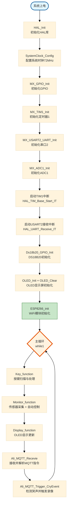
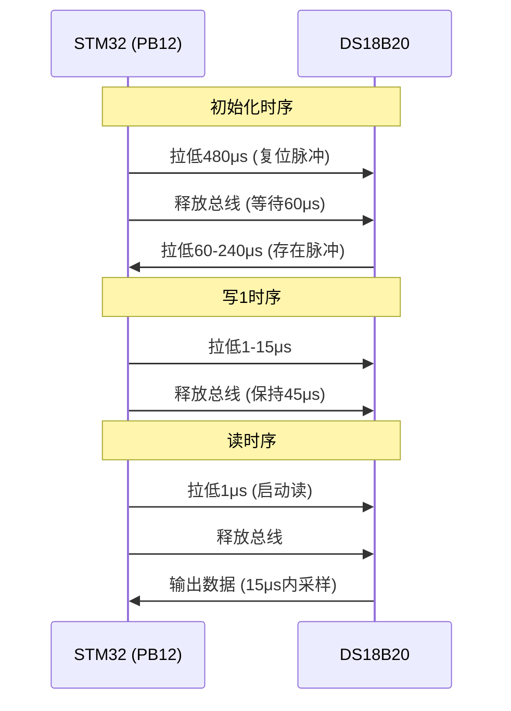
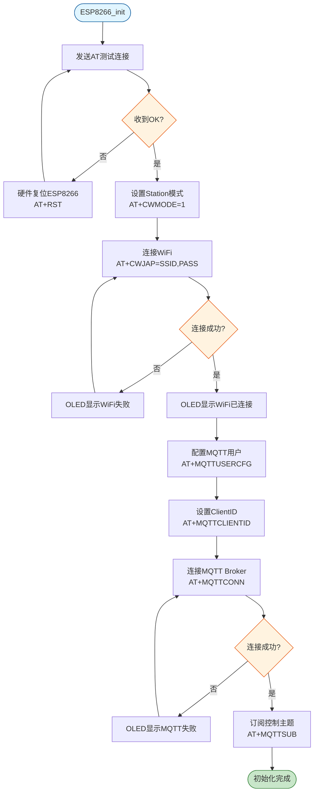
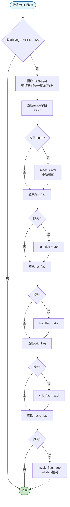
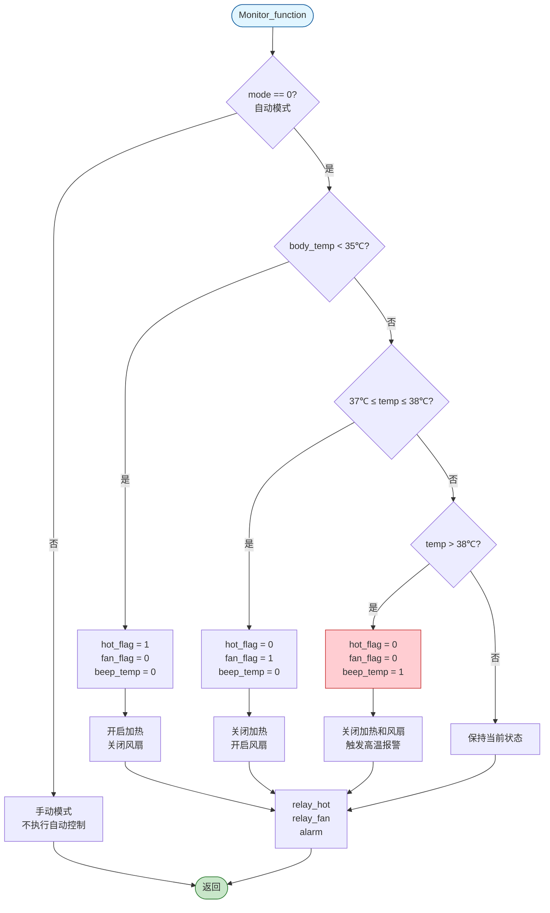

# 第四章 下位机软件设计

## 4.1 软件开发环境与工具链

### 4.1.1 开发环境配置

本系统下位机软件开发采用以下工具链：

**1. 集成开发环境 (IDE)**
- **Keil μVision5** (MDK-ARM V5.27)
  - 编译器：ARM Compiler V5.06
  - 调试器：内置ULINK调试器支持
  - 代码编辑器：支持语法高亮、自动补全、代码折叠

**2. 固件库**
- **STM32 HAL库** (Hardware Abstraction Layer)
  - 版本：STM32Cube FW_F1 V1.8.4
  - 优势：高度抽象、易于移植、官方长期维护

**3. 配置工具**
- **STM32CubeMX** V6.5.0
  - 图形化配置引脚、时钟树、外设
  - 自动生成初始化代码
  - 避免手动配置寄存器的繁琐和出错

**4. 下载调试工具**
- **ST-Link Utility** / **J-Link**
  - 固件烧录
  - 在线调试 (断点、单步、变量监视)

### 4.1.2 工程目录结构

```
Project_C8/
├── Core/
│   ├── Inc/                    # 头文件
│   │   ├── main.h
│   │   ├── stm32f1xx_it.h     # 中断服务函数声明
│   │   └── stm32f1xx_hal_conf.h
│   └── Src/                    # 源文件
│       ├── main.c              # 主程序 (459行)
│       ├── stm32f1xx_it.c      # 中断处理
│       ├── gpio.c              # GPIO初始化
│       ├── adc.c               # ADC配置
│       ├── tim.c               # 定时器配置
│       └── usart.c             # 串口配置
├── HAL/                        # 自定义HAL驱动
│   ├── AliESP8266/             # WiFi & MQTT通信 (808行)
│   │   ├── AliESP8266.c
│   │   └── AliESP8266.h
│   ├── DS18B20/                # 温度传感器驱动
│   │   ├── ds18b20.c
│   │   └── ds18b20.h
│   ├── OLED/                   # 显示驱动
│   │   ├── OLED_NEW.c
│   │   └── OLED_NEW.h
│   ├── delay/                  # 微秒级延时
│   └── key/                    # 按键扫描
├── Drivers/                    # ST官方HAL库
│   ├── STM32F1xx_HAL_Driver/
│   └── CMSIS/
└── MDK-ARM/                    # Keil工程文件
    └── Project_C8.uvprojx
```

---

## 4.2 主程序架构设计

### 4.2.1 程序执行流程

系统采用 **前后台系统** 架构：
- **前台 (主循环)**：周期性执行数据采集、逻辑判断、通信处理
- **后台 (中断)**：处理定时器中断、串口接收中断、按键中断



### 4.2.2 定时器中断服务

**TIM1中断配置**：
- **预分频器 (Prescaler)**：63
- **自动重装载值 (Period)**：999
- **中断频率**：$f = \frac{72MHz}{(63+1) \times (999+1)} = 1125 Hz$
- **中断周期**：约 0.89ms

**中断服务函数 (HAL_TIM_PeriodElapsedCallback)**：
```c
void HAL_TIM_PeriodElapsedCallback(TIM_HandleTypeDef *htim)
{
    if(htim == &htim1)
    {
        // 500ms计时 (用于传感器采样)
        time_1++;
        if(time_1 >= 562) {  // 562 * 0.89ms ≈ 500ms
            time_1 = 0;
            time_500ms = 1;  // 触发Monitor_function采样
        }
        
        // 1秒计时 (用于MQTT状态上报)
        time_2++;
        if(time_2 >= 1124) {  // 1124 * 0.89ms ≈ 1s
            time_2 = 0;
            flag_1 = 1;  // 触发Ali_MQTT_Publish_1
        }
        
        // 5秒计时 (用于完整状态上报)
        time_3++;
        if(time_3 >= 5620) {  // 5620 * 0.89ms ≈ 5s
            time_3 = 0;
            flag_2 = 1;  // 触发Ali_MQTT_Publish_2
        }
        
        // 声音传感器读取
        voice = HAL_GPIO_ReadPin(voice_GPIO_Port, voice_Pin);
        
        // 摇床电机控制逻辑
        if((Motor_Status & 0x80) == 0x80) {
            Motor_Count++;
            if(Motor_Count >= 5000) {  // 约4.5秒
                Motor_Count = 0;
                Motor_Status ^= 0x01;  // 切换正反转
            }
        }
    }
}
```

---

## 4.3 传感器数据采集模块

### 4.3.1 DS18B20温度采集

**1. 单总线时序实现**

DS18B20采用Dallas单总线协议，所有通信通过一根数据线完成。关键时序包括：



**2. 温度读取流程**

```c
uint16_t Ds18b20_Read_Temp(void)
{
    uint8_t temp_L, temp_H;
    uint16_t temp_value;
    
    // 1. 初始化
    if(Ds18b20_Init() != 0) {
        return 0xFFFF;  // 传感器未响应
    }
    
    // 2. 跳过ROM (单个设备)
    Ds18b20_Write_Byte(0xCC);
    
    // 3. 启动温度转换
    Ds18b20_Write_Byte(0x44);
    
    // 4. 等待转换完成 (12位模式约750ms)
    HAL_Delay(800);
    
    // 5. 重新初始化
    Ds18b20_Init();
    Ds18b20_Write_Byte(0xCC);
    
    // 6. 读取暂存器
    Ds18b20_Write_Byte(0xBE);
    temp_L = Ds18b20_Read_Byte();  // 低字节
    temp_H = Ds18b20_Read_Byte();  // 高字节
    
    // 7. 合成温度值 (单位: 0.1℃)
    temp_value = (temp_H << 8) | temp_L;
    temp_value = temp_value * 0.625;  // 转换为0.1℃单位
    
    return temp_value;
}
```

**3. 异常处理**
- **读数过滤**：若读取值 > 1000 (100℃)，则保持上一次有效值
- **初始化失败**：返回0xFFFF，主程序显示"--.-"

### 4.3.2 ADC湿度采集与滤波

**1. ADC配置参数**
- **通道**：ADC1_IN4 (PA4)
- **分辨率**：12位 (0~4095)
- **采样时间**：239.5个ADC时钟周期
- **转换时间**：$(239.5 + 12.5) / 10.67MHz \approx 23.6μs$

**2. 采集代码**
```c
// 单次转换模式
HAL_ADC_Start(&hadc1);
if(HAL_ADC_PollForConversion(&hadc1, 999) == HAL_OK) {
    adc_value = HAL_ADC_GetValue(&hadc1);
}
HAL_ADC_Stop(&hadc1);

// 转换为湿度百分比
humi = (adc_value / 4095.0) * 100;
```

**3. 滑动平均滤波** (可选优化)
```c
#define FILTER_SIZE 10
uint16_t adc_buffer[FILTER_SIZE];
uint8_t buf_index = 0;

// 存入缓冲区
adc_buffer[buf_index++] = adc_value;
if(buf_index >= FILTER_SIZE) buf_index = 0;

// 计算平均值
uint32_t sum = 0;
for(int i = 0; i < FILTER_SIZE; i++) {
    sum += adc_buffer[i];
}
adc_value = sum / FILTER_SIZE;
```

### 4.3.3 声音信号检测与去抖

**1. 硬件输出逻辑**
- **高电平 (1)**：环境安静
- **低电平 (0)**：检测到哭声

**2. 软件去抖算法**
```c
#define CRY_DEBOUNCE_COUNT 5
static uint8_t cry_counter = 0;

// 在定时器中断中读取
voice = HAL_GPIO_ReadPin(voice_GPIO_Port, voice_Pin);

// 在主循环中去抖
if(voice == 0) {  // 检测到低电平
    cry_counter++;
    if(cry_counter >= CRY_DEBOUNCE_COUNT) {
        cry_alarm = 1;  // 确认为哭声
    }
} else {
    cry_counter = 0;  // 重置计数器
    cry_alarm = 0;
}
```

---

## 4.4 MQTT通信模块实现

### 4.4.1 ESP8266初始化流程



**关键AT指令序列**：
```c
// 1. 测试连接
ESP8266_SendCmd("AT\r\n", "OK");

// 2. 设置WiFi模式
ESP8266_SendCmd("AT+CWMODE=1\r\n", "OK");

// 3. 连接WiFi (SSID和密码需根据实际修改)
ESP8266_SendCmd("AT+CWJAP=\"YourSSID\",\"YourPassword\"\r\n", "OK");

// 4. 配置MQTT参数
// LinkID=0, scheme=1(TCP), client_id, username, password
ESP8266_SendCmd("AT+MQTTUSERCFG=0,1,\"esp8266_01\",\"admin\",\"public\",0,0,\"\"\r\n", "OK");

// 5. 设置ClientID
ESP8266_SendCmd("AT+MQTTCLIENTID=0,\"esp8266_01\"\r\n", "OK");

// 6. 连接MQTT Broker (IP: 192.168.0.148, Port: 1883)
ESP8266_SendCmd("AT+MQTTCONN=0,\"192.168.0.148\",1883,0\r\n", "+MQTTCONNECTED");

// 7. 订阅控制主题
ESP8266_SendCmd("AT+MQTTSUB=0,\"device/esp8266_01/cmd\",1\r\n", "OK");
```

### 4.4.2 JSON数据格式设计

**1. 状态上报 (device/esp8266_01/status)**
```json
{
  "temp_x10": 265,        // 温度26.5℃ (放大10倍)
  "wet_adc": 1024,        // 湿度ADC原始值
  "wet": 0,               // 尿床标志 (0正常, 1尿床)
  "cry": 1,               // 哭声标志 (0哭泣, 1安静)
  "mode": 1,              // 工作模式 (0自动, 1手动)
  "fan_flag": 0,          // 风扇状态
  "hot_flag": 1,          // 加热状态
  "crib_flag": 0,         // 摇床状态
  "music_flag": 0,        // 音乐状态
  "temp_alarm": 0         // 高温报警
}
```

**2. 控制指令 (device/esp8266_01/cmd)**
```json
{
  "mode": 1,              // 切换模式
  "fan_flag": 1,          // 开启风扇
  "hot_flag": 0,          // 关闭加热
  "crib_flag": 1,         // 开启摇床
  "music_flag": 1         // 播放音乐
}
```

**3. 哭声触发录像 (babycam/trigger)**
```json
{
  "event": "cry",
  "seconds": 30,          // 录制时长
  "pre": 10               // 预录时长
}
```

### 4.4.3 MQTT消息发布实现

**使用snprintf安全构建JSON**：
```c
void Ali_MQTT_Publish_Status(void)
{
    char json_buf[512];
    int offset = 0;
    
    // 构建JSON字符串
    offset += snprintf(json_buf + offset, sizeof(json_buf) - offset, 
                      "{\"temp_x10\":%d", body_temp);
    offset += snprintf(json_buf + offset, sizeof(json_buf) - offset, 
                      ",\"wet_adc\":%d", adc_value);
    offset += snprintf(json_buf + offset, sizeof(json_buf) - offset, 
                      ",\"wet\":%d", beep_humi);
    offset += snprintf(json_buf + offset, sizeof(json_buf) - offset, 
                      ",\"cry\":%d", voice);
    offset += snprintf(json_buf + offset, sizeof(json_buf) - offset, 
                      ",\"mode\":%d", mode);
    offset += snprintf(json_buf + offset, sizeof(json_buf) - offset, 
                      ",\"fan_flag\":%d", fan_flag);
    offset += snprintf(json_buf + offset, sizeof(json_buf) - offset, 
                      ",\"hot_flag\":%d", hot_flag);
    offset += snprintf(json_buf + offset, sizeof(json_buf) - offset, 
                      ",\"crib_flag\":%d", crib_flag);
    offset += snprintf(json_buf + offset, sizeof(json_buf) - offset, 
                      ",\"music_flag\":%d", music_flag);
    offset += snprintf(json_buf + offset, sizeof(json_buf) - offset, 
                      ",\"temp_alarm\":%d}", beep_temp);
    
    // 发布MQTT消息
    char cmd[600];
    snprintf(cmd, sizeof(cmd), 
             "AT+MQTTPUB=0,\"device/esp8266_01/status\",\"%s\",1,0\r\n", 
             json_buf);
    Usart_SendString((unsigned char*)cmd, strlen(cmd));
}
```

### 4.4.4 MQTT消息接收与解析



**解析代码示例**：
```c
void Ali_MQTT_Recevie(void)
{
    char *p = strstr((char*)ESP8266_buf, "+MQTTSUBRECV");
    if(p == NULL) return;
    
    // 跳过前缀，定位到JSON内容
    // 格式: +MQTTSUBRECV:0,"topic",len,payload
    char *json_start = strchr(p, '{');
    if(json_start == NULL) return;
    
    // 解析mode
    char *mode_ptr = strstr(json_start, "\"mode\":");
    if(mode_ptr != NULL) {
        mode = atoi(mode_ptr + 7);
    }
    
    // 解析fan_flag
    char *fan_ptr = strstr(json_start, "\"fan_flag\":");
    if(fan_ptr != NULL) {
        fan_flag = atoi(fan_ptr + 11);
        relay_fan(fan_flag);  // 立即执行
    }
    
    // 解析music_flag
    char *music_ptr = strstr(json_start, "\"music_flag\":");
    if(music_ptr != NULL) {
        music_flag = atoi(music_ptr + 13);
        lullabuy(music_flag == 0 ? 0 : 1);  // 0播放, 1停止
    }
    
    // 清空缓冲区
    ESP8266_Clear();
}
```

---

## 4.5 自动控制逻辑实现

### 4.5.1 温度闭环控制算法



**控制逻辑代码**：
```c
if(mode == 0) {  // 自动模式
    if(body_temp < 35*10) {  // 体温 < 35℃
        hot_flag = 1;
        fan_flag = 0;
        beep_temp = 0;
    }
    else {
        hot_flag = 0;
        if(body_temp > 37*10 && body_temp <= 38*10) {  // 37-38℃
            fan_flag = 1;
            beep_temp = 0;
        }
        if(body_temp > 38*10) {  // > 38℃
            fan_flag = 0;
            beep_temp = 1;  // 高温报警
        }
    }
}

// 执行控制
relay_fan(fan_flag);
relay_hot(hot_flag);
if(beep_humi == 1 || beep_temp == 1) {
    alarm(1);  // 蜂鸣器报警
} else {
    alarm(0);
}
```

### 4.5.2 哭声检测与安抚联动

```c
// 在Monitor_function中
if(voice == 0 || (crib_flag == 1 && mode == 1)) {
    // 检测到哭声 或 手动开启摇床
    if((Motor_Status & 0x01) == 0x00) {
        Motor_Status |= 0x81;  // 启动摇床电机
    }
}

// 音乐控制
if(mode == 0) {  // 自动模式
    if(voice == 0) {  // 检测到哭声
        lullabuy(0);  // 播放音乐 (低电平触发)
    } else {
        lullabuy(1);  // 停止音乐
    }
} else {  // 手动模式
    // 由App通过MQTT控制music_flag
}
```

### 4.5.3 哭声触发视频录制

**防抖与节流机制**：
```c
#define CRY_DEBOUNCE_THRESHOLD 5
#define CRY_TRIGGER_INTERVAL_MS 60000  // 60秒

void Ali_MQTT_Trigger_CryEvent(void)
{
    static uint8_t cry_debounce_counter = 0;
    static uint8_t cry_triggered = 0;
    static uint32_t last_trigger_tick = 0;
    
    uint32_t now = HAL_GetTick();
    
    // 去抖：连续5次检测到哭声
    if(voice == 0) {
        cry_debounce_counter++;
        if(cry_debounce_counter >= CRY_DEBOUNCE_THRESHOLD) {
            // 节流：距离上次触发至少60秒
            if(!cry_triggered && (now - last_trigger_tick > CRY_TRIGGER_INTERVAL_MS)) {
                // 发送MQTT触发消息
                char cmd[200];
                snprintf(cmd, sizeof(cmd),
                        "AT+MQTTPUB=0,\"babycam/trigger\","
                        "\"{\\\"event\\\":\\\"cry\\\",\\\"seconds\\\":30,\\\"pre\\\":10}\",1,0\r\n");
                Usart_SendString((unsigned char*)cmd, strlen(cmd));
                
                cry_triggered = 1;
                last_trigger_tick = now;
            }
        }
    } else {
        cry_debounce_counter = 0;
        cry_triggered = 0;  // 恢复触发能力
    }
}
```

---

## 4.6 OLED显示模块实现

### 4.6.1 I²C软件模拟

**GPIO配置**：
```c
#define OLED_SCL_PIN  GPIO_PIN_10  // PB10
#define OLED_SDA_PIN  GPIO_PIN_11  // PB11
#define OLED_GPIO_PORT GPIOB

// SCL输出高电平
#define OLED_SCL_Set() HAL_GPIO_WritePin(OLED_GPIO_PORT, OLED_SCL_PIN, GPIO_PIN_SET)
// SCL输出低电平
#define OLED_SCL_Clr() HAL_GPIO_WritePin(OLED_GPIO_PORT, OLED_SCL_PIN, GPIO_PIN_RESET)

// SDA输出高电平
#define OLED_SDA_Set() HAL_GPIO_WritePin(OLED_GPIO_PORT, OLED_SDA_PIN, GPIO_PIN_SET)
// SDA输出低电平
#define OLED_SDA_Clr() HAL_GPIO_WritePin(OLED_GPIO_PORT, OLED_SDA_PIN, GPIO_PIN_RESET)
```

**I²C起始信号**：
```c
void I2C_Start(void)
{
    OLED_SDA_Set();
    OLED_SCL_Set();
    delay_us(5);
    OLED_SDA_Clr();  // SCL高电平时SDA下降沿
    delay_us(5);
    OLED_SCL_Clr();
}
```

### 4.6.2 显示内容布局

```
┌────────────────────────┐
│ 模式: 自动             │  行0 (0,0)
│                        │
│ 体温: 26.5℃           │  行2 (0,2)
│                        │
│ 是否尿床: 否  45       │  行4 (0,4)
│                        │
│ 是否听到哭声: 是       │  行6 (0,6)
└────────────────────────┘
```

**显示函数实现**：
```c
void Display_function(void)
{
    // 第1行：模式
    Oled_ShowCHinese(0, 0, (uint8_t*)"模式");
    Oled_ShowString(32, 0, (uint8_t*)":");
    if(mode == 0)
        Oled_ShowCHinese(40, 0, (uint8_t*)"自动");
    else
        Oled_ShowCHinese(40, 0, (uint8_t*)"手动");
    
    // 第3行：体温
    Oled_ShowCHinese(0, 2, (uint8_t*)"体温");
    Oled_ShowString(32, 2, (uint8_t*)":");
    OLED_Show_Temp(40, 2, body_temp);  // 显示26.5℃
    
    // 第5行：尿床检测
    Oled_ShowCHinese(0, 4, (uint8_t*)"是否尿床");
    Oled_ShowString(64, 4, (uint8_t*)":");
    if(beep_humi == 1)
        Oled_ShowCHinese(72, 4, (uint8_t*)"是");
    else
        Oled_ShowCHinese(72, 4, (uint8_t*)"否");
    OLED_ShowNum(96, 4, humi, 3);  // 显示湿度值
    
    // 第7行：哭声检测
    Oled_ShowCHinese(0, 6, (uint8_t*)"是否听到哭声");
    Oled_ShowString(96, 6, (uint8_t*)":");
    if(voice == 0)
        Oled_ShowCHinese(104, 6, (uint8_t*)"是");
    else
        Oled_ShowCHinese(104, 6, (uint8_t*)"否");
}
```

---

## 4.7 按键处理模块

### 4.7.1 按键扫描算法

**矩阵键盘扫描** (本设计为独立按键，简化处理)：
```c
uint8_t Chiclet_Keyboard_Scan(void)
{
    static uint8_t key_state = 0;  // 0: 未按下, 1: 已按下
    
    // 读取按键状态 (低电平有效)
    uint8_t k1 = HAL_GPIO_ReadPin(K1_GPIO_Port, K1_Pin);
    uint8_t k2 = HAL_GPIO_ReadPin(K2_GPIO_Port, K2_Pin);
    uint8_t k3 = HAL_GPIO_ReadPin(K3_GPIO_Port, K3_Pin);
    
    if(key_state == 0) {  // 未按下状态
        if(k1 == 0) {
            HAL_Delay(20);  // 软件去抖
            if(HAL_GPIO_ReadPin(K1_GPIO_Port, K1_Pin) == 0) {
                key_state = 1;
                return 1;
            }
        }
        if(k2 == 0) {
            HAL_Delay(20);
            if(HAL_GPIO_ReadPin(K2_GPIO_Port, K2_Pin) == 0) {
                key_state = 1;
                return 2;
            }
        }
        if(k3 == 0) {
            HAL_Delay(20);
            if(HAL_GPIO_ReadPin(K3_GPIO_Port, K3_Pin) == 0) {
                key_state = 1;
                return 3;
            }
        }
    } else {  // 已按下状态，等待释放
        if(k1 == 1 && k2 == 1 && k3 == 1) {
            key_state = 0;
        }
    }
    
    return 0;  // 无按键
}
```

### 4.7.2 按键功能映射

```c
void Key_function(void)
{
    key_num = Chiclet_Keyboard_Scan();
    if(key_num != 0) {
        switch(key_num) {
            case 1:  // K1: 切换模式
                mode = (mode == 0) ? 1 : 0;
                break;
            
            case 2:  // K2: 手动控制加热
                mode = 1;  // 强制切换到手动模式
                hot_flag = (hot_flag == 0) ? 1 : 0;
                break;
            
            case 3:  // K3: 手动控制风扇
                mode = 1;
                fan_flag = (fan_flag == 0) ? 1 : 0;
                break;
        }
    }
}
```

---

## 4.8 本章小结

本章详细阐述了基于STM32F103C8T6的下位机软件设计。采用**Keil MDK + STM32 HAL库**开发环境，构建了**前后台系统架构**。

**核心模块包括**：
1. **传感器采集**：实现了DS18B20单总线温度读取、ADC湿度采样和声音检测，并应用了滤波和去抖算法。
2. **MQTT通信**：通过ESP8266 AT指令实现WiFi连接和MQTT协议通信，设计了JSON格式的数据交换协议。
3. **自动控制**：实现了基于温度的闭环控制逻辑和哭声触发的安抚联动机制。
4. **人机交互**：通过OLED显示实时状态，通过按键实现模式切换和手动控制。

软件采用**模块化设计**，各功能模块职责清晰，便于调试和维护。完整的源代码见附录A。
