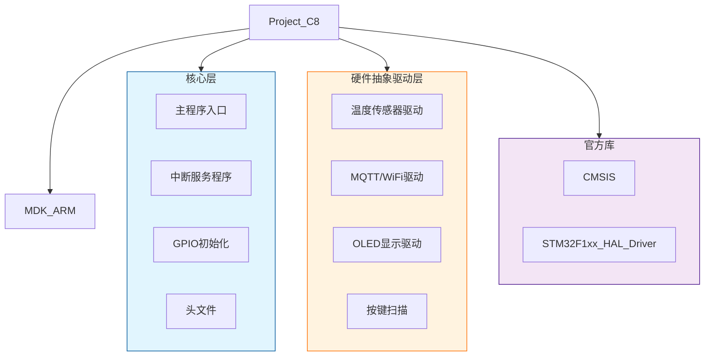
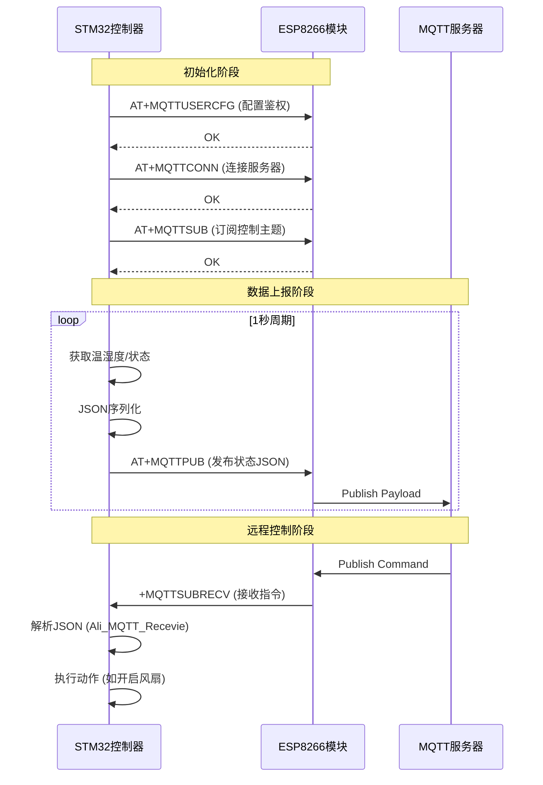

# 4 下位机软件设计

## 4.1 软件开发环境与工具链

高效且稳定的软件工程离不开标准化的开发环境。针对 STM32F103C8T6 平台的特性，本系统构建了一套集图形化配置、硬件抽象驱动及在线仿真于一体的交叉编译工具链。通过 STM32CubeMX 与 Keil MDK 的协同工作，实现了底层硬件资源的高效管理与业务逻辑的快速迭代。

### 4.1.1 固件开发平台配置
本系统的底层固件开发采用以下核心工具：

*   **集成开发环境 (IDE)**：选用 Keil μVision5 (MDK-ARM)。其内置的 ARM Compiler V5 编译器针对 Cortex-M3 内核进行了深度优化，能够生成紧凑且高效的机器码。
*   **硬件抽象层 (HAL 库)**：基于 STM32Cube FW_F1 V1.8.4。HAL 库提供了标准化的外设访问接口，屏蔽了底层寄存器的操作细节，增强了代码的可移植性。
*   **图形化配置工具**：利用 STM32CubeMX 进行引脚复用（Pinout）与时钟树（Clock Tree）规划，自动生成初始化代码，有效规避了引脚冲突问题。
*   **调试链路**：结合 ST-Link V2 仿真器，通过 SWD 协议实现固件的在线烧录与实时调试。

### 4.1.2 工程目录结构规划
为了实现代码的高内聚、低耦合，本工程建立了层次清晰的模块化目录结构。其中，`Core` 目录存放系统生成的核心初始化代码，`HAL` 目录专门存放针对本项目硬件定制的驱动程序（如温度传感器、OLED屏幕、WiFi模块），实现了硬件驱动与业务逻辑的分离。



图 4.1 下位机软件工程目录结构

## 4.2 主程序架构设计

嵌入式系统软件设计的核心在于如何协调实时性要求高的任务（如电机控制）与耗时较长的任务（如网络通信）。本系统采用了“前后台”架构：以中断服务程序作为“后台”处理硬实时任务，以无限循环（While Loop）作为“前台”处理业务逻辑与状态管理。

### 4.2.1 系统程序执行流程
系统上电后首先完成 HAL 库初始化、系统时钟配置及外设初始化。在主循环中，系统依次执行按键扫描、环境监测、显示刷新及网络数据处理。这种轮询机制确保了各个功能模块都能得到及时的响应。

```mermaid
flowchart TD
    Start((系统启动)) --> SysInit[HAL_Init / SystemClock_Config]
    SysInit --> PeripInit[GPIO/ADC/TIM/UART 初始化]
    PeripInit --> DevInit[OLED / DS18B20 / ESP8266 初始化]
    
    DevInit --> Loop{主循环 while(1)}
    
    Loop --> Key[按键扫描 Key_function]
    Key --> Monitor[环境监测 Monitor_function]
    Monitor --> Disp[屏幕显示 Display_function]
    Disp --> NetRx[MQTT数据接收 Ali_MQTT_Recevie]
    NetRx --> Cry[哭声检测与触发 Ali_MQTT_Trigger_CryEvent]
    Cry --> Loop
    
    style Start fill:#b9f6ca,stroke:#00c853,stroke-width:2px
    style Loop fill:#fff9c4,stroke:#fbc02d,stroke-width:2px
```
图 4.2 主程序执行流程图

### 4.2.2 定时器中断调度机制
系统利用 TIM1 定时器产生 1ms 的时基中断，构建了一个简单而精准的时间片轮转调度系统。在 `HAL_TIM_PeriodElapsedCallback` 回调函数中，维护了多个软件计数器，用于触发不同频率的任务。

*   **500ms 周期**：设置 `time_500ms` 标志位，触发温湿度数据采集。
*   **1000ms 周期**：设置 `flag_1` 标志位，触发 MQTT 心跳包与状态上报。
*   **电机步进控制**：在 1ms 中断中直接驱动步进电机引脚，确保摇床运动的平滑性与精确性。

关键代码实现（Core/Src/main.c）：

```c
void HAL_TIM_PeriodElapsedCallback(TIM_HandleTypeDef *htim)
{
    if(htim->Instance == htim1.Instance) // 定时器1触发中断
    {
        // 500ms 计时 - 用于温湿度采集
        time_1ms++;
        if(time_1ms >= 500) {
            time_1ms = 0;
            time_500ms = 1;
        }
    
        // 1000ms 计时 - 用于MQTT上报
        time_1++;
        if(time_1 >= 1000) {
            time_1 = 0;
            flag_1 = 1; 
        }

        // 步进电机驱动逻辑 (1ms精度)
        if(Motor_Status & 0x80) { // 电机使能
            if(Motor_Status & 0x01) Motor_Num++; else Motor_Num--; // 方向控制
            // ... GPIO 驱动逻辑 ...
            GPIOB->ODR &= 0xf0ff; 
            GPIOB->ODR |= Motor_Buf[Motor_Num%8] << 8;
        }
    }
}
```

## 4.3 多模态传感器数据采集

数据的准确性是智能监护的基础。系统集成了温度、湿度及声音传感器，针对不同传感器的电气特性，采用了相应的软件驱动策略。

### 4.3.1 DS18B20 温度与 ADC 湿度采集
DS18B20 采用单总线协议，对时序要求极高。软件中通过微秒级延时函数 `delay_us` 严格模拟通信时序。湿度数据则通过 STM32 的 ADC1 通道采集，经过软件滤波与线性映射转换为相对湿度百分比。

代码片段（`Monitor_function`）：

```c
void Monitor_function(void)
{
    uint16_t temp_init;
    if(time_500ms == 1) // 500ms 采样周期
    {
        time_500ms = 0;
        
        // --- 温度采集 (含异常值过滤) ---
        if(body_temp < 1000) temp_init = body_temp; // 保存旧值
        body_temp = Ds18b20_Read_Temp();            // 读取新值
        if(body_temp > 1000) body_temp = temp_init; // 过滤异常跳变
        
        // --- 湿度采集 (ADC) ---
        HAL_ADC_Start(&hadc1);
        if(HAL_ADC_PollForConversion(&hadc1, 999) == HAL_OK)
            adc_value = HAL_ADC_GetValue(&hadc1);
        HAL_ADC_Stop(&hadc1);
        
        // 线性映射: 0-4095 -> 0-100%
        humi = (adc_value/4095.00)*100;
    }
    // ...
}
```

### 4.3.2 哭声监测与多重消抖
系统通过数字 I/O 读取声音传感器的电平信号，并实现了软件消抖。当连续检测到声音信号且经过确认后，系统会触发紧急事件。为了防止网络频繁触发，在 `Ali_MQTT_Trigger_CryEvent` 函数中实现了防抖动（Debounce）与时间节流（Throttle）机制。

```c
// 哭声触发逻辑 (HAL/AliESP8266/AliESP8266.c)
void Ali_MQTT_Trigger_CryEvent(void)
{
    // voice引脚低电平表示检测到哭声
    if (voice == 0) {
        if (cry_debounce_counter < 255) cry_debounce_counter++;
        
        // 消抖阈值判断
        if (cry_debounce_counter >= CRY_DEBOUNCE_COUNT && !cry_triggered) {
            // 时间节流判断 (例如 60秒内只触发一次)
            if (elapsed >= CRY_TRIGGER_INTERVAL_MS) {
                // 构建并发送 MQTT 报警指令
                snprintf(txt, sizeof(txt), 
                    "AT+MQTTPUB=0,\"%s\",\"{\\\"event\\\":\\\"cry\\\",...}\",1,0\r\n",
                    TOPIC_BABYCAM_TRIGGER);
                uwifi_printf("%s", txt);
                cry_triggered = 1;
            }
        }
    } else {
        cry_debounce_counter = 0; // 信号消失，重置计数器
        cry_triggered = 0;
    }
}
```

## 4.4 MQTT 远程通信模块实现

本设计利用 ESP8266 Wi-Fi 模块构建了基于 MQTT 协议的物联网通信链路。STM32 通过串口（UART）发送 AT 指令集控制 ESP8266，实现了网络连接、报文发布与指令订阅。

### 4.4.1 通信建立与交互流程
系统启动后，按照“配置用户 -> 连接 Broker -> 订阅主题”的顺序建立连接。通信过程采用 JSON 格式封装数据，确保了数据结构的可扩展性与跨平台兼容性。


图 4.3 MQTT 通信交互时序图

### 4.4.2 结构化 JSON 报文封装
为了适配上位机（Android App）的解析需求，系统使用 `snprintf` 函数构建标准 JSON 字符串。上报数据包含温度（放大10倍以保留一位小数）、湿度、报警标志、执行器状态及哭声标志。

```c
// JSON 报文构建关键代码 (HAL/AliESP8266/AliESP8266.c)
void Ali_MQTT_Publish_Status(void)
{
    // ...
    // 构建 JSON: {"mode":0, "temp_x10":365, "cry":1, ...}
    n = snprintf(txt + offset, remain, "AT+MQTTPUB=0,\"%s\",\"{\", TOPIC_STATUS);
    offset += n; 
    
    n = snprintf(txt + offset, remain, "\\\"temp_x10\\\":%u\\,", (unsigned int)body_temp);
    offset += n;
    
    n = snprintf(txt + offset, remain, "\\\"cry\\\":%d\\,", voice); // voice=0为哭
    // ...
    snprintf(txt + offset, remain, "}\",1,0\r\n");
    uwifi_printf("%s", txt);
}
```

## 4.5 智能闭环控制与安抚联动

系统根据环境参数与传感器状态，实现了“感知-决策-执行”的闭环控制逻辑。

### 4.5.1 温度控制状态机
在自动模式（`mode == 0`）下，系统根据体温数据自动控制加热器和风扇：
*   **< 35.0℃**：开启加热 (`hot_flag = 1`)，关闭风扇。
*   **37.0℃ - 38.0℃**：开启风扇 (`fan_flag = 1`) 进行物理降温。
*   **> 38.0℃**：高温报警 (`beep_temp = 1`)，关闭风扇以防热风伤害，并触发声光报警。

### 4.5.2 哭声侦测与安抚联动
当检测到婴儿啼哭时，系统不仅会通过 MQTT 发送推送通知，还会立即启动本地安抚机制。
*   **摇摆控制**：启动步进电机，模拟摇篮的轻柔晃动。
*   **音乐播放**：通过 GPIO 控制语音模块播放安抚音乐。

```c
// 闭环控制逻辑 (Core/Src/main.c)
if(mode == 0) // 自动模式
{
    // 温度控制
    if(body_temp < 35*10) {
        hot_flag = 1; fan_flag = 0;
    } else {
        hot_flag = 0;
        if(body_temp > 37*10 && body_temp <= 38*10) {
            fan_flag = 1; // 开启风扇
        }
        if(body_temp > 38*10) {
            fan_flag = 0; beep_temp = 1; // 高温报警
        }
    }

    // 哭声安抚
    if(voice == 0) { // 检测到哭声
        lullabuy(0); // 播放音乐 (低电平触发)
        // 启动电机摇摆逻辑...
    } else {
        lullabuy(1); // 停止音乐
    }
}
```

## 4.6 本地交互与显示实现

为了提供直观的本地信息反馈，系统采用了 0.96 寸 OLED 显示屏和独立按键，构成了简洁的人机交互界面。

### 4.6.1 OLED 分层显示
系统通过模拟 I2C 协议驱动 SSD1306 屏幕。显示界面划分为状态栏（显示模式）、数据区（显示体温、湿度）和报警区（显示尿床与哭声状态）。`Display_function` 函数负责将内存中的状态变量实时渲染到屏幕上。

### 4.6.2 按键状态机扫描
针对 K1-K3 按键，软件采用了非阻塞式的消抖算法。`Chiclet_Keyboard_Scan` 函数通过状态判断滤除机械抖动，精准识别用户的单击操作，实现自动/手动模式切换及执行器的手动开关。

```c
// 按键处理 (Core/Src/main.c)
void Key_function(void)
{
    key_num = Chiclet_Keyboard_Scan();
    switch(key_num) {
        case 1: mode = !mode; break; // 切换 自动/手动 模式
        case 2: if(mode) hot_flag = !hot_flag; break; // 手动控制加热
        case 3: if(mode) fan_flag = !fan_flag; break; // 手动控制风扇
    }
}
```

## 4.7 本章小结

本章详细阐述了智能婴儿床下位机系统的软件设计与实现。通过前后台调度架构，有效保证了多任务环境下的系统实时性。借助 HAL 库与模块化设计思想，成功实现了多传感器数据的精准采集、MQTT 协议的高效透传以及“温控+安抚”的闭环逻辑。软件层面的多重消抖与异常过滤算法，显著提升了系统的鲁棒性，为后续与边缘 AI 及移动端的联调奠定了坚实基础。
