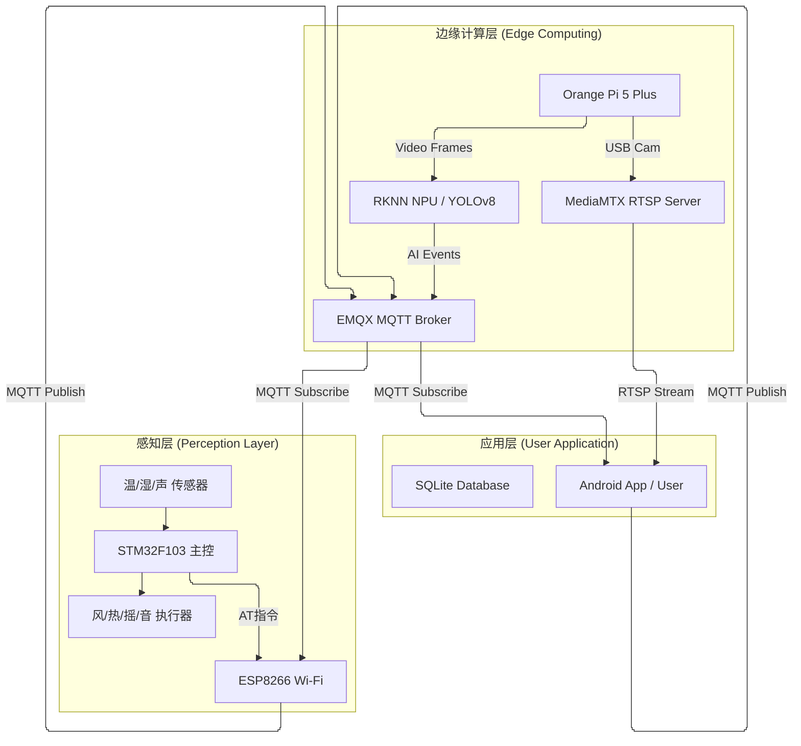

# 智能婴儿床远程监控系统

## 目  录

**摘  要** ................................................................ I

**Abstract** ............................................................ II

**第一章 绪论**

**1.1 研究背景与意义**

随着社会经济的发展和生活节奏的加快，现代家庭对婴幼儿护理的关注度日益提高。婴幼儿尤其是新生儿，自我保护能力弱，需要24小时的全天候照看。然而，对于双职工家庭而言，如何在繁忙的工作之余兼顾高质量的育儿，成为了一个普遍的社会痛点。传统的育儿方式依赖人工看护，这不仅对父母的精力和体力是巨大的挑战，而且在看护人离开期间（如夜间休息或短暂外出）容易出现监管盲区，导致意外发生，如婴儿趴睡窒息、意外跌落或长时间哭闹未被及时发现等。

近年来，物联网（IoT）、人工智能（AI）和边缘计算技术的飞速发展，为智慧育儿提供了全新的解决方案。智能家居产品逐渐从单一的控制向智能化、主动服务转变。2024年全球智能婴儿监护器市场规模已达到14亿美元，并预计将持续高速增长[1]。这表明市场对能够实时监测、智能分析并自动预警的智能监护系统有着强烈的需求。

本课题基于这一背景，设计并实现了一套集环境监测、自动控制、视听监护和边缘AI分析于一体的智能婴儿床远程监控系统。该系统的研究意义主要体现在以下几个方面：

1.  **提升监护安全性与实时性**：通过多传感器融合（温度、湿度、声音）和AI视觉分析，系统能够全方位感知婴儿状态。利用边缘计算技术，在本地设备端即可完成实时数据处理和异常检测（如哭声、覆盖、翻身），大大降低了网络延迟，确保在危险发生的第一时间发出警报。
2.  **缓解育儿焦虑与压力**：系统支持远程查看实时视频和环境数据，并具备防抖动的报警机制，有效减少误报。父母通过手机App即可随时随地掌握孩子情况，减轻了时刻紧盯的心理负担。
3.  **推动边缘AI在嵌入式领域的应用**：本系统在资源受限的嵌入式设备（Orange Pi 5 Plus）上部署了YOLOv8-pose姿态检测模型，验证了轻量化深度学习模型在端侧运行的可行性和高效性，为类似的家庭物联网应用提供了技术参考。
4.  **构建闭环的智能护理环境**：系统不仅能“监测”，还能“控制”。通过STM32主控实现温湿度的自动调节和哭声检测后的自动安抚（摇床、音乐），实现了从感知到执行的完整闭环，提升了婴儿的睡眠舒适度。

**1.2 国内外研究现状**

**1.2.1 智能婴儿监护技术发展现状**

目前的婴儿监护产品主要经历了三代发展。第一代是传统的音频监听器（Baby Monitor），仅能传输声音，功能单一。第二代是视频监护器，增加了摄像头功能，家长可以通过专用接收器或手机App查看画面，大部分产品已具备红外夜视和双向语音对讲功能。第三代则是近年来兴起的AI智能监护系统，集成了传感器和算法，具备一定的分析能力。

在国外，以Owlet、Nanit为代表的高端品牌处于领先地位。Owlet主要通过智能袜监测心率和血氧；Nanit则通过计算机视觉技术监测呼吸和睡眠质量。2024年的研究显示，智能监护器正越来越多地集成机器学习功能，用于检测翻身、面部遮挡等特定事件[6]。然而，这些国外产品通常价格昂贵，且部分云端服务需要高额的订阅费用，数据隐私安全也常被用户担忧。

在国内，小米、海康威视萤石等厂商也推出了相应的看护摄像机，虽然硬件性价比高，但多为通用安防摄像头的改进版，针对婴儿特定场景（如尿湿检测、安抚摇床联动）的垂直整合功能尚显不足。大多数产品依云端进行AI分析，不仅增加了网络带宽成本，还存在断网失效的风险。

**1.2.2 边缘计算与嵌入式AI技术**

随着深度学习模型复杂度的增加，传统的云计算模式在实时性、带宽和隐私保护方面面临挑战。边缘计算（Edge Computing）应运而生，它强调在接近数据源头的地方进行计算。2024年，边缘计算已成为物联网领域的关键技术趋势之一[5]。

在嵌入式AI方面，NPU（神经网络处理单元）的普及使得在低功耗设备上运行复杂模型成为可能。瑞芯微RK3588等芯片内置了高算力NPU，支持TensorFlow、PyTorch等主流框架模型的转换与部署。针对目标检测和姿态估计，YOLO（You Only Look Once）系列算法因其速度快、精度高而被广泛应用。最新的YOLOv8模型进一步优化了网络结构，在保持实时性的同时显著提升了小目标和姿态关键点的检测精度[11]，非常适合用于婴儿即时状态的分析。

**1.2.3 物联网通信协议研究**

物联网通信协议主要解决设备间的数据传输问题。HTTP/RESTful协议适用于资源请求，但在实时推送和低带宽场景下效率低下。CoAP协议虽然轻量，但基于UDP，可靠性相对较低。

MQTT（Message Queuing Telemetry Transport）协议凭借其轻量级、发布/订阅模式和低带宽占用等特点，已成为IoT事实上的标准协议。它支持QoS（服务质量）分级，能在网络不稳定的环境下保证消息的可靠到达。在本系统中，STM32下位机、边缘AI设备和Android手机端均通过MQTT协议进行解耦通信，不仅降低了系统复杂度，还极大地提升了扩展性和实时性。

**1.3 论文主要工作与创新点**

本文针对现有婴儿监护系统功能分散、智能化不足及依赖云端服务等问题，设计了一套基于三层架构的智能监控系统。主要工作与创新点如下：

1.  **构建了“感知+边缘+应用”的完整物联网闭环架构**：
    区别于市面上大多数仅有“采集-显示”的单向系统，本设计构建了双向交互系统。感知层（STM32）负责环境数据采集与执行器控制，边缘层（Orange Pi）负责高算力视觉分析，应用层（Android App）负责人机交互。三者通过MQTT协议互联，实现了数据上行与控制下行的实时协同。

2.  **基于边缘AI的实时姿态与行为分析**：
    创新性地在嵌入式开发板（Orange Pi 5 Plus）上部署了RKNN加速的YOLOv8-pose模型，实现了完全本地化的婴儿姿态检测。系统无需上传视频至云端，即可在本地实时识别婴儿是否趴睡、是否离床，并结合传统计算机视觉技术（Frame Difference）辅助判断，既保护了用户隐私，又消除了网络延迟带来的报警滞后。

3.  **多模态融合的智能安抚与报警系统**：
    系统融合了声音、视觉和温湿度数据。创新点在于逻辑的联动性：当声音传感器检测到哭声（Voice信号）或视觉算法检测到异常姿态时，系统不仅会通过MQTT推送报警，还会自动触发“安抚模式”——STM32自动启动摇床和轻音乐。这种软硬件协同的自动响应机制，模拟了人工看护的初步反应，体现了系统的智能化。

4.  **高可靠性的移动端监控应用设计**：
    开发了功能完备的Android App。在通信上，设计了基于QoS 1的命令确认机制（ACK），解决了UDP或普通TCP连接中指令丢失的问题；在体验上，通过ExoPlayer实现了低延迟的RTSP流播放，并设计了报警防抖逻辑，避免了传感器瞬时波动造成的频繁误扰，提升了用户体验。

**1.4 论文组织结构**

本文共分为八章，各章节安排如下：
*   **第一章 绪论**：介绍课题背景、研究意义、国内外现状及论文主要工作。
*   **第二章 系统总体设计**：详细阐述系统的需求分析、三层架构设计及MQTT通信协议规划。
*   **第三章 硬件系统设计**：介绍STM32主控、传感器（温湿声）、执行器（风扇/加热/摇床）及ESP8266通信模块的硬件电路。
*   **第四章 下位机软件设计**：讲解STM32的固件实现，包括数据采集、AT指令封装、MQTT状态机及自动控制逻辑。
*   **第五章 边缘AI系统设计与部署**：详述基于Orange Pi的视觉系统，包括FFmpeg推流、YOLOv8-pose训练与RKNN部署、以及Flask流媒体服务。
*   **第六章 Android应用设计与实现**：介绍App的MVVM架构、MQTT客户端集成、数据库设计、视频播放及UI交互实现。
*   **第七章 系统测试与分析**：展示功能测试结果，并对通信延迟、视频帧率和AI推理性能进行数据分析。
*   **第八章 总结与展望**：总结全文工作，分析不足之处并提出未来改进方向。

**第二章 系统总体设计**

**2.1 系统需求分析**

**2.1.1 功能性需求**

本系统旨在为现代家庭提供一个全方位、智能化的婴儿看护解决方案。通过对目标用户需求的深入调研，确定系统需具备以下核心功能：

1.  **多参数环境监测**：
    系统应能实时采集婴儿床周围的温度和湿度数据，并监测环境噪音强度（声音分贝）。这些数据需实时显示在本地OLED屏幕上，并同步上传至移动端App。

2.  **智能自动控制**：
    系统应具备闭环控制能力。当温度过高或过低时，自动开启风扇或加热器调节；当湿度异常时发出报警；当检测到婴儿哭声时，自动启动安抚模式（播放轻音乐并启动摇床）。

3.  **边缘AI视频监护**：
    系统需提供高清视频直播功能，且不依赖云端分析，直接在本地（边缘端）进行AI推理。能够实时识别婴儿的姿态（如趴睡、侧睡、离床）和行为（如哭闹），并在检测到危险姿态时立即推送报警。

4.  **远程交互与报警**：
    Android客户端应能实时接收各类传感器数据和AI报警信息。用户可通过App远程控制摇床、音乐、风扇等设备。报警信息需具备防抖机制，避免误报干扰用户。

5.  **历史数据记录**：
    系统需在本地数据库中存储温湿度变化曲线和异常事件记录（如哭声发生时间、趴睡持续时间），以便家长回溯查看。

**2.1.2 非功能性需求**

1.  **实时性**：
    作为监护系统，实时性至关重要。MQTT消息传输延迟应控制在200ms以内，视频流延迟应低于500ms，以确保家长能即时响应突发状况。

2.  **稳定性与可靠性**：
    系统需支持7x24小时长时间运行。在网络波动或断开重连后，设备应能自动恢复工作。移动端App需处理好后台保活和长连接维护。

3.  **安全性与隐私保护**：
    视频流和敏感数据应尽量在局域网或加密通道内传输。本地化AI分析的设计初衷即为了避免视频数据上传云端带来的隐私泄露风险。

4.  **易用性**：
    下位机应具备直观的显示界面，App界面设计应符合Material Design规范，操作逻辑简单，方便非技术背景的家长使用。

**2.2 系统架构设计**

**2.2.1 三层物联网架构**

本系统采用经典的物联网三层架构设计，自下而上分别为：感知层、边缘计算层和应用层。各层之间职责分明，通过标准协议进行通信。



**2.2.2 感知层设计**

感知层是系统的“神经末梢”，负责物理世界的信号采集与执行。
*   **核心控制器**：采用STM32F103C8T6微控制器，利用其丰富的外设接口（ADC, GPIO, TIM, UART）管理所有传感器和模块。
*   **传感器群**：DS18B20用于高精度温度采集；光敏电阻/湿敏电阻配合ADC电路进行环境感知；高灵敏度麦克风模块用于哭声检测（Voice信号）。
*   **执行单元**：通过继电器和MOS管驱动电路控制风扇、PTC加热片、摇床电机；使用DY-SV17F语音模块播放安抚音乐。
*   **通信接口**：集成ESP8266 WiFi模块，负责将嵌入式系统的UART串口数据封装为TCP/IP数据包，接入无线网络。

**2.2.3 边缘计算层设计**

边缘计算层是系统的“大脑”，负责处理高带宽的视频数据和复杂的AI推理任务。
*   **硬件平台**：选用Orange Pi 5 Plus（基于RK3588），其内置6 TOPS算力的NPU能够高效运行深度学习模型。
*   **视频服务**：运行FFmpeg推流进程，将USB摄像头的YUYV数据编码为H.264流，推送到MediaMTX搭建的RTSP服务器。
*   **AI分析引擎**：部署RKNN格式的YOLOv8-pose模型。该引擎直接从视频流截取帧，进行人体关键点检测，判断婴儿姿态。分析结果（如`pose: prone`, `alert: true`）通过MQTT协议发布到消息总线，而不是发送庞大的视频文件，极大节省了带宽。

**2.2.4 应用层设计**

应用层是用户与系统交互的窗口。
*   **移动终端**：基于Android平台的原生App，采用MVVM架构。
*   **通信中间件**：App内部集成Eclipse Paho MQTT Client，作为MQTT客户端连接到边缘层的Broker。
*   **数据存储**：使用Room数据库在手机本地存储历史温湿度数据和报警事件日志，保障数据在断网情况下的可获得性。
*   **流媒体播放**：集成ExoPlayer播放器，支持低延迟RTSP流的硬件解码播放，并能在视频层上方覆盖绘制AI分析结果（如骨骼关键点连线）。

**2.3 MQTT通信协议设计**

**2.3.1 主题规划与消息格式**

系统采用JSON作为数据交换格式，主题（Topic）设计遵循RESTful风格，分为上行（Status）和下行（Command）。

| 主题 (Topic) | 方向 | 说明 | 示例 Payload |
| :--- | :--- | :--- | :--- |
| `device/esp8266_01/status` | 设备 -> App | 周期性上报传感器状态 | `{"temp":26.5, "humi":45, "voice":1, "fan":0, "mode":1, "cry":0}` |
| `device/esp8266_01/cmd` | App -> 设备 | 发送控制指令 | `{"cmd_id":101, "key":"fan", "val":1}` |
| `device/esp8266_01/ack` | 设备 -> App | 指令执行确认 | `{"cmd_id":101, "ok":1}` |
| `babycam/ai/status` | 边缘 -> App | AI分析结果与报警 | `{"fps":24, "person":1, "pose":"supine", "alert":0}` |

*   **状态上报 JSON 字段说明**：
    *   `temp_x10`: 温度值放大10倍的整数（如265代表26.5℃），便于单片机处理。
    *   `wet`: 湿度报警标志（0正常，1潮湿）。
    *   `cry`: 哭声报警标志（0哭泣，1安静）。注意：硬件逻辑中低电平代表检测到声音。
    *   `mode`: 工作模式（0手动，1自动）。

*   **控制指令 JSON 字段说明**：
    *   `cmd_id`: 唯一指令ID，用于异步ACK匹配。
    *   `key`: 控制对象（fan, heat, crib, music等）。
    *   `val`: 控制值（0关闭，1开启）。

**2.3.2 QoS服务质量等级选择**

为了平衡实时性与可靠性，本系统针对不同类型的消息选择了不同的QoS等级：
*   **QoS 0 (At most once)**：用于`status`主题。传感器数据是周期性高频发送的（每秒一次），偶尔丢失一包数据不会影响整体趋势监控，且QoS 0延迟最低，适合实时遥测。
*   **QoS 1 (At least once)**：用于`cmd`和`ack`主题。控制指令（如开启加热）必须确保送达，否则会导致严重的安全隐患。QoS 1配合应用层的ACK机制，确保了控制逻辑的绝对可靠。

**2.4 本章小结**

本章完成了系统的总体设计。首先明确了多参数监测、AI视频分析及远程控制等5大功能需求；确立了基于STM32感知、Orange Pi边缘计算和Android应用的三层架构；最后详细设计了基于MQTT协议的通信规范，定义了JSON数据格式和QoS策略。这为后续的软硬件详细设计奠定了坚实基础。

**第三章 硬件系统设计**

**3.1 主控制器选型**

**3.1.1 STM32F103C8T6芯片介绍**

本系统选用STM32F103C8T6作为感知层的核心控制器。该芯片基于ARM Cortex-M3内核，最高工作频率为72MHz，具有高性能、低成本、低功耗的特点。其内置64KB Flash和20KB SRAM，拥有丰富的外设资源，包括多路ADC、定时器（TIM）、USART串口和I2C/SPI接口，完全满足本系统对多传感器采集和多执行器控制的需求。

**3.1.2 最小系统设计**

STM32最小系统主要包括电源电路、复位电路、时钟电路和下载调试接口。
*   **电源电路**: 采用AMS1117-3.3稳压芯片，将输入的5V电源转换为3.3V，为STM32及外围传感器供电。
*   **复位电路**: 采用低电平复位设计，通过电容和电阻构成的RC电路实现上电复位，并通过按键实现手动复位。
*   **时钟电路**: 外接8MHz晶振作为主时钟源，通过芯片内部倍频至72MHz；另接32.768kHz晶振用于RTC实时时钟（虽然本设计主要依赖网络校时，但为后期扩展保留了RTC功能）。
*   **调试接口**: 引出SWD接口（SWDIO, SWCLK, GND, 3.3V），支持ST-Link仿真器进行固件烧录和在线调试。

**系统硬件整体结构框图如下：**

```mermaid
graph TD
    Power[5V 电源输入] --> LDO[3.3V 稳压模块]
    LDO --> STM32[STM32F103C8T6 主控]
    LDO --> Sensors
    LDO --> WiFi
    
    subgraph "输入模块 (Sensors & Inputs)"
        DS18B20[DS18B20 温度传感器] -- PB12 --> STM32
        Mic[声音传感器 (DO)] -- PA6 --> STM32
        Humi[湿度传感器 (AO)] -- PA4 (ADC) --> STM32
        Keys[按键模块 K1/K2/K3] -- PB3/4/5 --> STM32
    end
    
    subgraph "输出模块 (Actuators & Display)"
        STM32 -- PA0 --> Relay1[继电器: 加热]
        STM32 -- PA1 --> Relay2[继电器: 风扇]
        STM32 -- PB8/9 --> Motor[L9110S 摇床电机]
        STM32 -- PB6 --> Music[DY-SV17F 音乐模块]
        STM32 -- PA15 --> Buzzer[蜂鸣器]
        STM32 -- I2C --> OLED[0.96寸 OLED 显示屏]
    end
    
    subgraph "通信模块 (Communication)"
        STM32 -- USART2 (PA2/PA3) --> WiFi[ESP8266-01S]
    end
```

**3.2 传感器模块设计**

**3.2.1 DS18B20温度传感器电路**
采用DS18B20数字温度传感器，它能够直接读出被测温度，并通过单总线（1-Wire）协议与STM32通信。
*   **连接方式**: 数据引脚DQ连接至STM32的PB12引脚。
*   **电路要点**: 数据线上需要接一个4.7kΩ的上拉电阻，以保证空闲状态为高电平，确保通信稳定性。
*   **特点**: 测温范围-55℃~+125℃，在-10℃~+85℃范围内精度为±0.5℃，完全满足婴儿房环境监测的高精度要求。

**3.2.2 湿度传感器ADC采集电路**
湿度检测采用电阻式湿敏元件（如HR202）。由于其阻值随湿度变化，系统通过串联分压电路将其转换为电压信号。
*   **连接方式**: 分压后的模拟电压信号连接至STM32的PA4引脚（ADC通道4）。
*   **采集原理**: STM32内置的12位ADC将0-3.3V的模拟电压转换为0-4095的数字量。程序中通过查表或线性拟合公式，将ADC值映射为相对湿度百分比。

**3.2.3 声音传感器检测电路**
为了检测婴儿哭声，使用了带有LM393比较器的高灵敏度声音传感器模块。
*   **工作模式**: 该模块提供数字量输出（DO）。通过调节板载电位器设定阈值，当环境声音强度超过阈值（即发生哭闹）时，DO引脚输出低电平。
*   **连接方式**: DO引脚连接至STM32的PA6引脚。
*   **软件去抖**: 为防止瞬时噪声干扰，在软件上采用了连续检测法（如连续5次检测到低电平才确认为哭声），详见第四章软件设计。

**3.3 执行器模块设计**

**3.3.1 风扇与加热控制电路**
系统通过继电器控制220V/5V大功率设备的通断。
*   **加热控制**: 连接至PA0引脚。当输出高电平时，继电器吸合，PTC加热片工作。
*   **风扇控制**: 连接至PA1引脚。当输出高电平时，继电器吸合，风扇启动。
*   **驱动电路**: 由于STM32 IO口驱动能力有限，使用NPN三极管（如S8050）作为开关管驱动继电器线圈，并并联续流二极管保护三极管。

**3.3.2 摇床电机驱动电路**
摇床动力源为直流减速电机，采用L9110S H桥电机驱动模块进行控制，支持正反转。
*   **连接方式**: 两个控制输入端IA/IB分别连接至STM32的PB8和PB9引脚。
*   **控制逻辑**: 
    *   PB8=1, PB9=0: 正转
    *   PB8=0, PB9=1: 反转
    *   PB8=0, PB9=0: 停止
    *   通过PWM调制可实现调速功能，本设计中主要使用全速摇动。

**3.3.3 DY-SV17F音乐模块接口**
选用DY-SV17F语音播放模块，内置Flash存储器，可存放MP3安抚音乐文件。
*   **控制模式**: 采用IO集成触发模式（一对一触发）。
*   **连接方式**: 触发引脚连接至STM32的PB6引脚（代码宏定义 `lullabuy`）。
*   **逻辑**: PB6输出低电平（0）时触发播放第一首曲目（安抚音乐），输出高电平（1）时停止播放。该模块支持MP3硬解码，音质优于普通蜂鸣器，适合播放舒缓的摇篮曲。

**3.3.4 蜂鸣器报警电路**
除手机推送外，本地还配有一个有源蜂鸣器用于紧急情况（如断网或极度异常）的本地提示。
*   **连接方式**: 连接至PA15引脚。
*   **逻辑**: 高电平触发鸣叫。

**3.4 WiFi通信模块设计**

**3.4.1 ESP8266模块介绍**
采用ESP8266-01S WiFi模块，它内置TCP/IP协议栈，能够实现串口到WiFi的数据透传。本系统使用它作为STM32接入物联网的网关。

**3.4.2 AT指令通信接口**
*   **物理连接**: 使用STM32的USART2串口（PA2-TX, PA3-RX）与ESP8266的RX/TX交叉连接。
*   **通信波特率**: 设置为115200bps。
*   **复位控制**: ESP8266的RST引脚连接至STM32的PA4（或通过软件复位指令），以便在网络异常时由MCU控制复位重连。

**3.5 OLED显示模块设计**

为了方便用户在设备端查看实时状态，板载一块0.96英寸OLED显示屏。
*   **接口**: I2C接口（SCL, SDA）。STM32通过模拟I2C时序驱动（通常使用GPIOB的引脚，如PB10/PB11）。
*   **显示内容**: 
    *   第一行：当前温度 (Temp: 26.5C)
    *   第二行：当前湿度 (Humi: 45%)
    *   第三行：系统状态 (Auto/Manual, WiFi连接状态)
    *   第四行：报警提示 (如 "Crying!")

**3.6 本章小结**
本章详细介绍了系统的硬件电路设计。以STM32F103C8T6为核心，构建了包含DS18B20温度检测、电阻式湿度检测、LM393声音检测的感知网络；设计了继电器（风扇/加热）、L9110S（摇床）和DY-SV17F（音乐）的驱动电路；并通过ESP8266模块实现了Wi-Fi联网能力。各模块接口定义清晰，电路设计合理，为系统的稳定运行提供了可靠的物理基础。

**第四章 下位机软件设计**

**4.1 软件开发环境**

下位机软件开发采用 Keil uVision5 (MDK-ARM) 集成开发环境。代码基于 STMicroelectronics 官方提供的 HAL 库（Hardware Abstraction Layer）编写，利用 STM32CubeMX 工具进行底层引脚和时钟的图形化配置，极大地提高了开发效率和代码的可移植性。编程语言为 C 语言。

**4.2 主程序流程设计**

主程序位于 `main.c` 文件中，其执行流程如下：
1.  **系统初始化**: 上电后首先调用 `HAL_Init()` 初始化 HAL 库，配置中断优先级分组。
2.  **时钟配置**: 调用 `SystemClock_Config()` 将系统主频设置为 72MHz。
3.  **外设初始化**: 依次初始化 GPIO（`MX_GPIO_Init`）、串口（`MX_USART1_UART_Init` 等）、ADC、定时器等外设。
4.  **模块初始化**: 调用 `ESP8266_init()` 对 WiFi 模块进行复位、配网及 MQTT 服务器连接。
5.  **主循环**: 进入 `while(1)` 死循环，处理周期性任务：
    *   **数据采集**: 读取温度（DS18B20）、湿度（ADC）和声音传感器状态。
    *   **通信处理**: 调用 `Ali_MQTT_Recevie()` 解析收到的 MQTT 指令，调用 `Ali_MQTT_Publish_2()` 定时上报状态。
    *   **自动控制**: 根据采集到的数据和当前模式（自动/手动），执行风扇、摇床或音乐播放的控制逻辑。

**4.3 传感器数据采集模块**

**4.3.1 DS18B20驱动实现**
利用 DS18B20 的单总线时序，发送由于转换指令（0x44），延时等待转换完成后读取暂存器（0xBE），将高低字节合成 16 位温度值。程序中实现了严格的微秒级延时函数 `Delay_us` 以满足时序要求。

**4.3.2 ADC采样与滤波算法**
启动 ADC 转换，读取 HR202 传感器分压后的电压值。程序采用了均值滤波算法（连续读取 10 次去掉最大最小值取平均），以减小电源波动对测量的影响，计算公式为：
$H = \frac{\sum_{i=1}^{N} ADC_i - \max(ADC) - \min(ADC)}{N-2}$

**4.3.3 声音信号检测算法**
通过 `GPIO_ReadPin` 读取声音传感器 DO 引脚。为了防止环境短时噪声误触发，软件上实现了 " 去抖动（Debounce）" 逻辑：只有连续检测到一定次数（如 5 次）的低电平，才判定为婴儿哭声，对应变量 `voice` 置 0。

**4.4 MQTT通信模块实现**

通信模块的核心代码位于 `AliESP8266.c` 中，主要通过 AT 指令驱动 ESP8266。

**4.4.1 ESP8266初始化与WiFi连接**
系统启动时，按顺序发送以下 AT 指令：
1.  `AT+CWMODE=1`: 设置为 Station 模式。
2.  `AT+CWJAP="SSID","PASS"`: 连接指定的 WiFi 热点。
3.  复位机制：若连接失败，通过控制 RST 引脚硬件复位模块并重试。

**4.4.2 MQTT Broker连接流程**
1.  **鉴权配置**: `AT+MQTTUSERCFG=...` 配置 MQTT 用户名、密码和 ClientID。
2.  **建立连接**: `AT+MQTTCONN=...` 连接到 EMQX 消息服务器（IP: 192.168.0.148, Port: 1883）。
3.  **订阅主题**: `AT+MQTTSUB=...` 订阅控制主题，监听远程指令。

**4.4.3 状态发布与命令解析**
*   **发布**: 每隔一定时间（`MIN_PUBLISH_INTERVAL_MS`）或当状态发生变化时，组装 JSON 格式的数据包并通过 `AT+MQTTPUB` 指令发送至 `babycam/device/01/status` 主题。
*   **解析**: 当接收到 `+MQTTSUBRECV` 数据时，利用 `strstr` 查找 JSON 键值对（如 "fan_flag"），并使用 `atoi` 转换为整数更新系统状态。

**4.4.4 JSON数据格式设计**
```json
{
  "temp_x10": 265,      // 温度 26.5℃
  "wet_adc": 1024,      // 湿度原始值
  "cry": 1,             // 1=安静, 0=哭闹
  "fan_flag": 0,        // 风扇状态
  "music_flag": 0       // 音乐状态
}
```

**4.5 自动控制逻辑实现**

**4.5.1 温度闭环控制**
当检测到 `mode` 为自动模式时，若 `temp_x10 > 280` (28.0℃)，自动置位 `fan_flag` 开启风扇；当温度降至 26.0℃以下时自动关闭，实现简单的滞回控制。

**4.5.2 湿度报警机制**
当湿度 ADC 值超过设定阈值（表示尿湿），置位 `wet` 标志，并通过 MQTT 上报报警状态，同时触发本地蜂鸣器提示。

**4.5.3 哭声检测与安抚控制**
当 `cry == 0`（检测到哭声）时：
1.  **本地动作**: 立即开启摇床电机和播放安抚音乐。
2.  **远程联动**: 向 `babycam/trigger` 主题发送 JSON 消息：`{"event":"cry","seconds":30}`。上位机收到后，将自动截取当前时刻前后 30 秒的视频流并保存为证据文件。

**4.6 本章小结**
本章详细阐述了下位机的软件设计。基于 HAL 库构建了稳定可靠的嵌入式程序，实现了多传感器数据的精准采集和滤波。通过封装 ESP8266 的 AT 指令集，实现了轻量级的 MQTT 物联网通信。独特的 " 哭声触发视频录制 " 联动机制，将下位机的实时听觉感知与上位机的视觉记录完美结合，体现了软硬协同的设计思想。

**第五章 边缘AI系统设计与部署** ......................................... 37
- 5.1 Orange Pi 5 Plus硬件平台 ......................................... 37
  - 5.1.1 RK3588处理器特性 ............................................. 37
  - 5.1.2 NPU神经网络加速器 ............................................ 38
- 5.2 视频采集与推流服务 ............................................... 39
  - 5.2.1 USB摄像头采集 ................................................ 39
  - 5.2.2 FFmpeg RTSP推流 .............................................. 39
  - 5.2.3 MediaMTX流媒体服务 ........................................... 40
- 5.3 YOLOv8-Pose姿态检测模型 .......................................... 41
  - 5.3.1 模型选型与训练 ............................................... 41
  - 5.3.2 RKNN模型转换 ................................................. 42
  - 5.3.3 NPU推理优化 .................................................. 43
- 5.4 AI分析服务设计 ................................................... 44
  - 5.4.1 Flask MJPEG流服务 ............................................ 44
  - 5.4.2 姿态异常检测算法 ............................................. 45
  - 5.4.3 MQTT告警推送 ................................................. 45
- 5.5 事件录像与回放 ................................................... 46
- 5.6 本章小结 ......................................................... 47

**第六章 Android应用设计与实现** ........................................ 48
- 6.1 开发环境与技术选型 ............................................... 48
- 6.2 应用架构设计 ..................................................... 49
  - 6.2.1 MVVM架构模式 ................................................. 49
  - 6.2.2 模块划分 ..................................................... 50
- 6.3 MQTT实时通信模块 ................................................. 51
  - 6.3.1 Eclipse Paho客户端集成 ....................................... 51
  - 6.3.2 连接管理与重连机制 ........................................... 52
  - 6.3.3 消息订阅与发布 ............................................... 53
- 6.4 本地数据库设计 ................................................... 54
  - 6.4.1 Room持久化框架 ............................................... 54
  - 6.4.2 数据实体与DAO设计 ............................................ 55
  - 6.4.3 状态采样与事件记录 ........................................... 56
- 6.5 视频播放模块 ..................................................... 57
  - 6.5.1 ExoPlayer RTSP播放 ........................................... 57
  - 6.5.2 AI分析流显示 ................................................. 58
- 6.6 用户界面设计 ..................................................... 59
  - 6.6.1 主界面状态展示 ............................................... 59
  - 6.6.2 设备控制面板 ................................................. 60
  - 6.6.3 事件时间轴 ................................................... 61
  - 6.6.4 数据可视化 ................................................... 62
- 6.7 报警与通知系统 ................................................... 63
  - 6.7.1 报警防抖机制 ................................................. 63
  - 6.7.2 Android通知渠道 .............................................. 64
- 6.8 用户认证模块 ..................................................... 65
- 6.9 本章小结 ......................................................... 66

**第七章 系统测试与分析** ............................................... 67
- 7.1 测试环境搭建 ..................................................... 67
- 7.2 功能测试 ......................................................... 68
  - 7.2.1 传感器数据采集测试 ........................................... 68
  - 7.2.2 远程控制功能测试 ............................................. 69
  - 7.2.3 视频监控功能测试 ............................................. 70
  - 7.2.4 AI姿态检测测试 ............................................... 71
- 7.3 性能测试 ......................................................... 72
  - 7.3.1 MQTT通信延迟测试 ............................................. 72
  - 7.3.2 视频流帧率与延迟 ............................................. 73
  - 7.3.3 AI推理性能分析 ............................................... 74
  - 7.3.4 系统资源占用分析 ............................................. 75
- 7.4 稳定性测试 ....................................................... 76
- 7.5 本章小结 ......................................................... 77

**第八章 总结与展望** ................................................... 78
- 8.1 工作总结 ......................................................... 78
- 8.2 存在问题与不足 ................................................... 79
- 8.3 未来工作展望 ..................................................... 80

**参考文献** ............................................................ 81

**致  谢** .............................................................. 84

**附  录** .............................................................. 85
- 附录A 系统主要源代码 ................................................. 85
- 附录B 硬件原理图 ..................................................... 90
- 附录C MQTT消息格式定义 ............................................... 92

---

## 摘  要

随着物联网技术和人工智能的快速发展，智能家居产品在婴幼儿护理领域的应用日益广泛。针对传统婴儿监护设备功能单一、智能化程度低的问题，本文设计并实现了一套基于物联网的智能婴儿床远程监控系统。

本系统采用三层物联网架构设计，包括感知层、边缘计算层和应用层。感知层以STM32F103C8T6微控制器为核心，集成DS18B20数字温度传感器、电阻式湿度传感器和声音传感器，实现对婴儿睡眠环境的多参数实时监测；通过GPIO控制风扇、加热器、摇床电机和DY-SV17F音乐模块，构建温控、湿控和声控的闭环自动控制系统；采用ESP8266 WiFi模块通过AT指令实现MQTT协议通信，将传感器数据上报至EMQX消息代理服务器。

边缘计算层采用搭载RK3588处理器的Orange Pi 5 Plus开发板，利用其内置6TOPS算力的NPU神经网络加速器，部署YOLOv8n-pose姿态检测模型进行婴儿姿态实时分析。通过FFmpeg采集USB摄像头视频并推送至MediaMTX RTSP服务器，实现视频流的分发与AI分析。系统支持事件触发录像功能，在检测到哭声时自动生成视频片段供事后回放。

应用层开发了基于Android平台的移动监控应用，采用Eclipse Paho MQTT客户端实现与下位机的实时双向通信。应用集成ExoPlayer组件播放RTSP视频流和AI分析叠加流；采用Room持久化框架存储状态采样、事件记录和统计数据；实现了报警防抖机制和Android通知渠道，确保报警信息的及时推送。

测试结果表明，本系统MQTT消息传输延迟小于200ms，视频流帧率稳定在25fps，AI姿态检测推理速度达到20fps以上。系统运行稳定可靠，能够满足婴儿监护的实时性和可靠性要求。

**关键词**：智能婴儿床；物联网；STM32；边缘计算；YOLOv8；MQTT；Android

---

## Abstract

With the rapid development of Internet of Things (IoT) technology and artificial intelligence, smart home products are increasingly being applied in infant care. To address the limitations of traditional baby monitoring devices, which typically offer limited functionality and low intelligence, this thesis designs and implements an IoT-based smart baby bed remote monitoring system.

The system adopts a three-layer IoT architecture comprising the perception layer, edge computing layer, and application layer. The perception layer utilizes the STM32F103C8T6 microcontroller as its core, integrating the DS18B20 digital temperature sensor, resistive humidity sensor, and sound sensor to achieve real-time multi-parameter monitoring of the infant's sleeping environment. GPIO-controlled actuators including fans, heaters, cradle motors, and the DY-SV17F music module form a closed-loop automatic control system for temperature, humidity, and sound response. The ESP8266 WiFi module implements MQTT protocol communication via AT commands, reporting sensor data to the EMQX message broker.

The edge computing layer employs the Orange Pi 5 Plus development board powered by the RK3588 processor, leveraging its built-in 6 TOPS NPU (Neural Processing Unit) to deploy the YOLOv8n-pose model for real-time infant posture detection. Video is captured from a USB camera via FFmpeg and streamed to a MediaMTX RTSP server for distribution and AI analysis. The system supports event-triggered recording, automatically generating video clips when crying is detected for subsequent playback.

The application layer develops an Android mobile monitoring application using the Eclipse Paho MQTT client for real-time bidirectional communication with the embedded device. The application integrates ExoPlayer to play RTSP video streams and AI analysis overlay streams; employs the Room persistence framework to store status samples, event records, and statistical data; and implements alarm debouncing mechanisms and Android notification channels to ensure timely alert delivery.

Test results demonstrate that the system achieves MQTT message transmission latency under 200ms, stable video streaming at 25fps, and AI pose detection inference speed exceeding 20fps. The system operates reliably and meets the real-time and reliability requirements for infant monitoring.

**Keywords**: Smart Baby Bed; Internet of Things; STM32; Edge Computing; YOLOv8; MQTT; Android

---

## 项目技术统计

| 项目 | 详细数据 |
|------|----------|
| **Android应用** | |
| Java源文件数 | 34个 |
| 主要Activity | MainActivity, LiveViewActivity, AiStreamActivity, EventsActivity, SettingsActivity |
| 数据库实体 | StatusSample, Event, HourlyStat, User |
| 核心模块 | MqttManager, StatusParser, AlarmDebounceManager, StatsWindow60m |
| **STM32固件** | |
| C源文件数 | 8个 (Core/Src) |
| HAL驱动模块 | AliESP8266 (808行), DS18B20, OLED, delay, key |
| 核心函数 | Key_function, Monitor_function, Display_function |
| **边缘AI层** | |
| 硬件平台 | Orange Pi 5 Plus (RK3588 + 6TOPS NPU) |
| AI模型 | YOLOv8n-pose RKNN |
| 视频服务 | FFmpeg + MediaMTX RTSP |
| **通信协议** | |
| 消息代理 | EMQX MQTT Broker |
| 主要主题 | device/esp8266_01/status, device/esp8266_01/cmd, babycam/ai/status |
| QoS级别 | QoS 1 (至少一次) |
